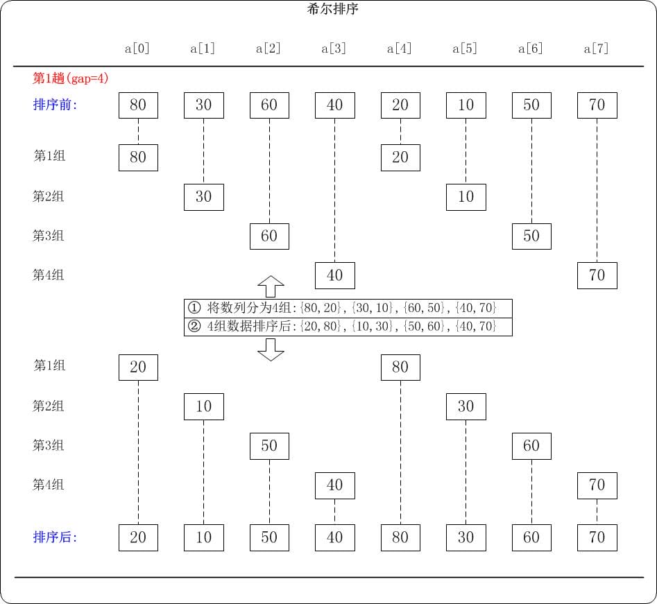
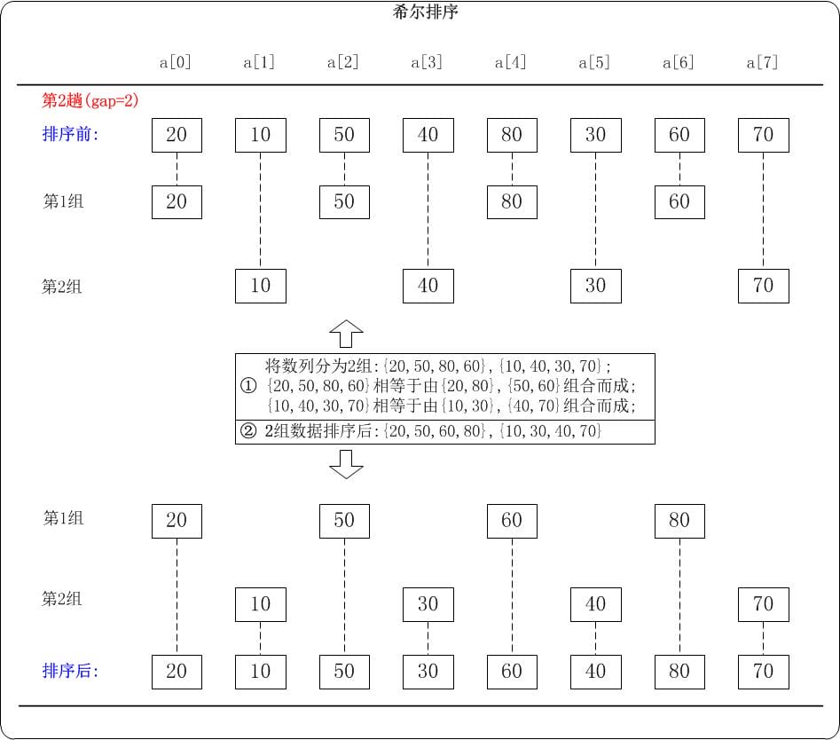
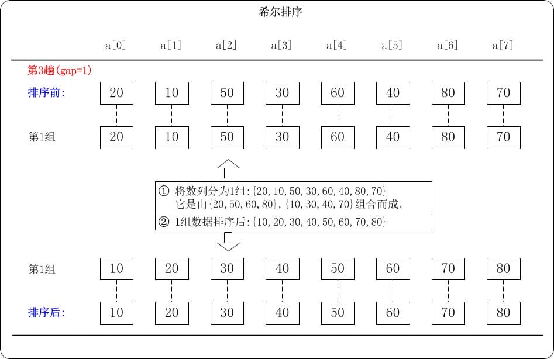

本页面将简要介绍希尔排序。

## 定义

`希尔排序`（英语：Shell sort），也称为缩小增量排序法，是 [插入排序](./insertion-sort.md) 的一种改进版本。希尔排序以它的发明者希尔（英语：Donald Shell）命名。

## 过程

排序对不相邻的记录进行比较和移动：

1.  将待排序序列分为若干子序列（每个子序列的元素在原始数组中间距相同）；
2.  对这些子序列进行插入排序；
3.  减小每个子序列中元素之间的间距，重复上述过程直至间距减少为 $1$。

## 分析

希尔排序实质上是一种`分组插入`方法。它的基本思想是: 对于n个待排序的数列，取一个小于n的整数`gap`(gap 被称为步长)将待排序元素分成若干个组子序列，所有距离为 gap 的倍数的记录放在同一个组中；然后，对各组内的元素进行直接插入排序。 这一趟排序完成之后，每一个组的元素都是有序的。然后减小 gap 的值，并重复执行上述的分组和排序。重复这样的操作，当 gap = 1 时，整个数列就是有序的。

## 举例

下面以数列`{80, 30, 60, 40, 20, 10, 50, 70}`为例，演示它的希尔排序过程。

### 第1趟: (gap = 4)



当gap=4时，意味着将数列分为4个组: `{80, 20}`, `{30, 10}`, `{60, 50}`, `{40, 70}`。 对应数列: `{80, 30, 60, 40, 20, 10, 50, 70}`。
对这4个组分别进行排序，排序结果: `{20, 80}`, `{10, 30}`, `{50, 60}`, `{40, 70}`。 
对应数列: `{20, 10, 50, 40, 80, 30, 60, 70}`

### 第2趟: (gap = 2)



当gap=2时, 意味着将数列分为2个组: `{20, 50, 80, 60}`, `{10, 40, 30, 70}`。 对应数列: `{20, 10, 50, 40, 80, 30, 60, 70}` 注意: `{20, 50, 80, 60}`实际上有两个有序的数列`{20, 80}`和`{50, 60}`组成。 `{10, 40, 30, 70}`实际上有两个有序的数列`{10, 30}`和`{40, 70}`组成。 
对这2个组分别进行排序，排序结果: `{20, 50, 60, 80}`, `{10, 30, 40, 70}`。 
对应数列: `{20, 10, 50, 30, 60, 40, 80, 70}`

### 第3趟: (gap = 1)



当gap=1时, 意味着将数列分为1个组: `{20, 10, 50, 30, 60, 40, 80, 70}` 注意: `{20, 10, 50, 30, 60, 40, 80, 70}`实际上有两个有序的数列`{20, 50, 60, 80}`和`{10, 30, 40, 70}`组成。 
对这1个组分别进行排序，排序结果: `{10, 20, 30, 40, 50, 60, 70, 80}`

## 性质

### 稳定性

希尔排序是一种不稳定的排序算法。

### 时间复杂度

希尔排序的最优时间复杂度为 $O(n)$。

希尔排序的平均时间复杂度和最坏时间复杂度与间距序列的选取有关。设间距序列为 $H$，下面给出 $H$ 的两种经典选取方式，这两种选取方式均使得排序算法的复杂度降为 $o(n^2)$ 级别。

**命题 $1$**：若间距序列为 $H= \{ 2^k-1\mid k=1,2,\ldots,\lfloor\log_2 n\rfloor \}$（从大到小），则希尔排序算法的时间复杂度为 $O(n^{3/2})$。

**命题 $2$**：若间距序列为 $H= \{ k=2^p\cdot 3^q\mid p,q\in \mathbb N,k\le n \}$（从大到小），则希尔排序算法的时间复杂度为 $O(n\log^2 n)$。

为证明这两个命题，我们先给出一个重要的定理并证明它，这个定理反应了希尔排序的最主要特征。

**定理 $1$**：只要程序执行了一次 $\text{InsertionSort}(h)$，不管之后怎样调用 $\text{InsertionSort}$ 函数，$A$ 数组怎样变换，下列性质均会被一直保持：

$$
\begin{array}{c}
A_1,A_{1+h},A_{1+2h},\ldots \\
A_2,A_{2+h},A_{2+2h},\ldots \\
\vdots \\
A_h,A_{h+h},A_{h+2h},\ldots
\end{array}
$$

**证明**：

我们先证明一个引理：

> **引理 $1$**：对于整数 $n,m$、正整数 $l$ 与两个数组 $X(x_1,x_2,\ldots,x_{n+l}),Y(y_1,y_2,\ldots,y_{m+l})$，满足如下要求：
>
> $$
> y_1 \le x_{n+1},y_2 \le x_{n+2},\ldots,y_l \le x_{n+l}
> $$
>
> 则我们将两个数组分别升序排序后，上述要求依然成立。
>
> **证明**：
>
> 设数组 $X$ 排序完为数组 $X'(x'_1,\ldots,x'_{n+l})$，数组 $Y$ 排序完为数组 $Y'(y'_1,\ldots,y'_{m+l})$。
>
> 对于任何 $1\le i\le l$，$x'_{n+i}$ 小等于数组 $X'$ 中的 $l-i$ 个元素，也小等于数组 $X$ 中的 $l-i$ 个元素（这是因为 $X$ 与 $X'$ 的元素可重集合是相同的）。
>
> 那么在可重集合 $\{x_{n+1},\ldots,x_{n+l} \} \subset X$ 中，大等于 $x'_{n+i}$ 的元素个数不超过 $l-i$ 个。
>
> 进而小于 $x'_{n+i}$ 的元素个数至少有 $i$ 个，取出其中的 $i$ 个，设它们为 $x_{n+k_1},x_{n+k_2},\ldots,x_{n+k_i}$。于是有：
>
> $$
> y_{k_1}\le x_{n+k_1}\le x'_{n+i},y_{k_2}\le x_{n+k_2}\le x'_{n+i},\ldots,y_{k_i}\le x_{n+k_i}\le x'_{n+i}
> $$
>
> 所以 $x'_{n+i}$ 至少大等于 $Y$ 也即 $Y'$ 中的 $i$ 个元素，那么自然有 $y'_i\le x'_{n+i}\,(1\le i\le l)$。
>
> **证毕**

再回到原命题的证明：

我们实际上只需要证明调用完 $\text{InsertionSort}(h)$ 的紧接着下一次调用 $\text{InsertionSort}(k)$ 后，$h$ 个子列仍有序即可，之后容易用归纳法得出。下面只考虑下一个调用：

执行完 $\text{InsertionSort}(h)$ 后，如下组已经完成排序：

$$
\begin{array}{c}
A_1,A_{1+h},A_{1+2h},\ldots \\
A_2,A_{2+h},A_{2+2h},\ldots \\
\vdots \\
A_h,A_{h+h},A_{h+2h},\ldots
\end{array}
$$

而之后执行 $\text{InsertionSort}(k)$，则会将如下组排序：

$$
\begin{array}{c}
A_1,A_{1+k},A_{1+2k},\ldots \\
A_2,A_{2+k},A_{2+2k}, \ldots \\
\vdots \\
A_k,A_{k+k},A_{k+2k},\ldots
\end{array}
$$

对于每个 $i$ $(1\le i\le \min(h,k))$，考虑如下两个组：

$$
\begin{array}{c}
A_i,A_{i+k},A_{i+2k},\ldots \\
\ldots,A_{i+h},A_{i+h+k},A_{i+h+2k},\ldots
\end{array}
$$

第二个组前面也加上“$\ldots$”的原因是可能 $i+h\ge k$ 从而前面也有元素。

则第二个组就是引理 $1$ 中的 $X$ 数组，第一个组就是 $Y$ 数组，$l$ 就是第二个组从 $i+h$ 之后顶到末尾的长度，$n$ 是第二个组中前面那个“$\ldots$”的长度，$m$ 是第一个组去掉前 $l$ 个后剩下的个数。

又因为有：

$$
A_i\le A_{i+h},A_{i+k}\le A_{i+h+k},\ldots
$$

所以由引理 $1$ 可得执行 $\text{InsertionSort}(k)$ 将两个组分别排序后，这个关系依然满足，即依然有 $A_i\le A_{i+h}\,(1\le i\le \min(h,k))$。

若有 $i>\min(h,k)$，容易发现取正整数 $w$ $(1\le w\le \min(h,k))$ 再加上若干个 $k$ 即可得到 $i$，则之前的情况已经蕴含了此情况的证明。

综合以上论述便有：执行完 $\text{InsertionSort}(k)$ 依然有 $A_i\le A_{i+h}\,(1\le i\le n-h)$。

得证。

**证毕**

这个定理揭示了希尔排序在特定集合 $H$ 下可以优化复杂度的关键，因为在整个过程中，它可以一致保持前面的成果不被摧毁（即 $h$ 个子列分别有序），从而使后面的调用中，指针 $i$ 的移动次数大大减少。

接下来我们单拎出来一个数论引理进行证明。这个定理在 OI 界因 [小凯的疑惑](https://www.luogu.com.cn/problem/P3951) 一题而大为出名。而在希尔排序复杂度的证明中，它也使得定理 $1$ 得到了很大的扩展。

> **引理 $2$**：若 $a,b$ 均为正整数且互素，则不在集合 $\{ax+by\mid x,y\in \mathbb N \}$ 中的最大正整数为 $ab-a-b$。
>
> **证明**：
>
> 分两步证明：
>
> -   先证明方程 $ax+by=ab-a-b$ 没有 $x,y$ 均为非负整数的解：
>
>     若无非负整数的限制，容易得到两组解 $(b-1,-1),(-1,a-1)$。
>
>     通过其通解形式 $x=x_0+tb,y=y_0-ta$，容易得到上面两组解是“相邻”的（因为 $b-1-b=-1$）。
>
>     当 $t$ 递增时，$x$ 递增，$y$ 递减，所以如果方程有非负整数解，必然会夹在这两组解中间，但这两组解“相邻”，中间没有别的解。
>
>     故不可能有非负整数解。
> -   再证明对任意整数 $c > ab-a-b$，方程 $ax+by=c$ 有非负整数解：
>
>     我们找一组解 $(x_0,y_0)$ 满足 $0\le x_0 < b$（由通解的表达式，这可以做到）。
>
>     则有：
>
>     $$
>     by_0=c-ax_0\ge c-a(b-1)>ab-a-b-ab+a=-b
>     $$
>
>     所以 $b(y_0+1) > 0$，又因为 $b>0$，所以 $y_0+1>0$，所以 $y_0\ge 0$。
>
>     所以 $(x_0,y_0)$ 为一组非负整数解。
>
> 综上得证。
>
> **证毕**

而下面这个定理则揭示了引理 $2$ 是如何扩展定理 $1$ 的。

**定理 $2$**：如果 $\gcd(h_{t+1},h_t)=1$，则程序先执行完 $\text{InsertionSort}(h_{t+1})$ 与 $\text{InsertionSort}(h_t)$ 后，执行 $\text{InsertionSort}(h_{t-1})$ 的时间复杂度为 $O\left(\dfrac{nh_{t+1}h_t}{h_{t-1}} \right)$，且对于每个 $j$，其 $i$ 的移动次数是 $O\left(\dfrac{h_{t+1}h_t}{h_{t-1}} \right)$ 级别的。

**证明**：

对于 $j\le h_{t+1}h_t$ 的部分，$i$ 的移动次数显然是是 $O\left(\dfrac{h_{t+1}h_t}{h_{t-1}} \right)$ 级别的。

故以下假设 $j>h_{t+1}h_t$。

对于任意的正整数 $k$ 满足 $1\le k\le j-h_{t+1}h_t$，注意到：$h_{t+1}h_t-h_{t+1}-h_t<h_{t+1}h_t\le j-k\le j-1$

又因为 $\gcd(h_{t+1},h_t)=1$，故由引理 $2$，得存在非负整数 $a,b$，使得：$ah_{t+1}+bh_t=j-k$。

即得：

$$
k=j-ah_{t+1}-bh_t
$$

由定理 $1$，得：

$$
A_{j-bh_t}\le A_{j-(b-1)h_t}\le \ldots\le A_{j-h_t}\le A_j
$$

与

$$
A_{j-bh_t-ah_{t+1}}\le A_{j-bh_t-(a-1)h_{t+1}}\le \ldots\le A_{j-bh_t-h_{t+1}}\le A_{j-bh_t}
$$

综合以上既有：$A_k=A_{j-ah_{t+1}-bh_t}\le A_j$。

所以对于任何 $1\le k\le j-h_{t+1}h_t$，有 $A_k\le A_j$。

在 Shell-Sort 伪代码中 $i$ 指针每次减 $h_{t-1}$，减 $O\left(\dfrac{h_{t+1}h_t}{h_{t-1}} \right)$ 次，即可使得 $i\le j-h_{t+1}h_t$，进而有 $A_i\le A_j$，不满足 while 循环的条件退出。

证明完对于每个 $j$ 的移动复杂度后，即可得到总的时间复杂度：

$$
\sum_{j=h_{t-1}+1}^n{O\left(\frac{h_{t+1}h_t}{h_{t-1}} \right)}=O\left(\frac{nh_{t+1}h_t}{h_{t-1}}\right)
$$

得证。

**证毕**

认真观察定理 $2$ 的证明过程，可以发现：定理 1 可以进行“线性组合”，即 $A$ 以 $h$ 为间隔有序，以 $k$ 为间隔亦有序，则以 $h$ 和 $k$ 的非负系数线性组合仍是有序的。而这种“线性性”即是由引理 $2$ 保证的。

有了这两个定理，我们可以命题 $1$ 与 $2$。

先证明命题 $1$：

**证明**：

将 $H$ 写为序列的形式：

$$
H(h_1=1,h_2=3,h_3=7,\ldots,h_{\lfloor \log_2 n\rfloor}=2^{\lfloor \log_2 n\rfloor}-1)
$$

Shell-Sort 执行顺序为：$\text{InsertionSort}(h_{\lfloor \log_2 n\rfloor}),\text{InsertionSort}(h_{\lfloor \log_2 n\rfloor-1}),\ldots,\text{InsertionSort}(h_2),\text{InsertionSort}(h_1)$.

分两部分去分析复杂度：

-   对于前面的若干个满足 $h_t\ge \sqrt{n}$ 的 $h_t$，显然有 $\text{InsertionSort}(h_t)$ 的时间复杂度为 $O\left(\dfrac{n^2}{h_t} \right)$。

    考虑对最接近 $\sqrt{n}$ 的项 $h_k$，有：

    $$
    O\left(\frac{n^2}{h_t} \right)=O(n^{3/2})
    $$

    而对于 $i> k$ 的 $h_i$，因为有 $2h_i< h_{i+1}$，所以可得：

    $$
    O\left(\frac{n^2}{h_i} \right)=O(n^{3/2}/2^{i-k})\,(i>k)
    $$

    所以大等于 $\sqrt n$ 部分的总时间复杂度为：

    $$
    \sum_{i=k}^{\lfloor \log_2 n\rfloor}{O(n^{3/2}/2^{i-k})}=O(n^{3/2})
    $$

-   对于后面剩下的满足 $h_t< \sqrt{n}$ 的项，前两项的复杂度还是 $O(n^{3/2})$，而对于后面的项 $h_t$，有定理 $2$ 可得时间复杂度为：

    $$
    O\left(\frac{nh_{t+2}h_{t+1}}{h_t} \right)=O\left(\frac{nh_{t+2}\cdot h_{t+2}/2}{h_{t+2}/4} \right)=O(nh_{t+2})
    $$

    再次利用 $2h_i < h_{i+1}$ 性质可得此部分总时间复杂度为（下式中 $k$ 沿用了上一种情况中的含义）：

    $$
    2O(n^{3/2})+\sum_{i=1}^{k-3}{O(nh_{i+1})}=O(n^{3/2})+\sum_{i=1}^{k-3}{O(nh_{k-1}/2^{k-i-3})}=O(n^{3/2})+O(nh_{k-1})=O(n^{3/2})
    $$

综上可得总时间复杂度即为 $O(n^{3/2})$。

**证毕**

再证明命题 $2$：

**证明**：

注意到一个事实：如果已经执行过了 $\text{InsertionSort}(2)$ 与 $\text{InsertionSort}(3)$，那么因为 $2\cdot 3-2-3=1$，所以由定理 $2$，每个元素只有与它相邻的前一个元素可能大于它，之前的元素全部都小于它。于是 $i$ 指针只需要最多两次就可以退出 while 循环。也就是说，此时再执行 $\text{InsertionSort}(1)$，复杂度降为 $O(n)$。

更进一步：如果已经执行过了 $\text{InsertionSort}(4)$ 与 $\text{InsertionSort}(6)$，我们考虑所有的下标为奇数的元素组成的子列与下标为偶数的元素组成的子列。则这相当于把这两个子列分别执行 $\text{InsertionSort}(2)$ 与 $\text{InsertionSort}(3)$。那么也是一样，这时候再执行 $\text{InsertionSort}(2)$，相当于对两个子列分别执行 $\text{InsertionSort}(1)$，也只需要两个序列和的级别，即 $O(n)$ 的复杂度就可以将数组变为 $2$ 间隔有序。

不断归纳，就可以得到：如果已经执行过了 $\text{InsertionSort}(2h)$ 与 $\text{InsertionSort}(3h)$，则执行 $\text{InsertionSort}(h)$ 的复杂度也只有 $O(n)$。

接下来分为两部分分析复杂度：

-   对于 $h_t>n/3$ 的部分，则执行每个 $\text{InsertionSort}(h_t)$ 的复杂度为 $O(n^2/h_t)$。

    而 $n^2/h_t<3n$，所以单词插入排序复杂度为 $O(n)$。

    而这一部分元素个数是 $O(\log^2 n)$ 级别的，所以这一部分时间复杂度为 $O(n\log^2 n)$。

-   对于 $h_t\le n/3$ 的部分，因为 $3h_t\le n$，所以这之前已经执行了 $\text{InsertionSort}(2h_t)$ 与 $\text{InsertionSort}(3h_t)$，于是执行 $\text{InsertionSort}(h_t)$ 的时间复杂度是 $O(n)$。

    还是一样的，这一部分元素个数也是 $O(\log^2 n)$ 级别的，所以这一部分时间复杂度为 $O(n\log^2 n)$。

综上可得总时间复杂度即为 $O(n\log^2 n)$。

**证毕**

### 空间复杂度

希尔排序的空间复杂度为 $O(1)$。

## 实现

::: info 代码实现

C++[^ref1]

::: code-tabs

@tab Java

```java
public class ShellSort {

    /**
     * 希尔排序
     *
     * 参数说明: 
     *     a -- 待排序的数组
     *     n -- 数组的长度
     */
    public static void shellSort1(int[] a, int n) {

        // gap为步长，每次减为原来的一半。
        for (int gap = n / 2; gap > 0; gap /= 2) {

            // 共gap个组，对每一组都执行直接插入排序
            for (int i = 0 ;i < gap; i++) {

                for (int j = i + gap; j < n; j += gap) {

                    // 如果a[j] < a[j-gap]，则寻找a[j]位置，并将后面数据的位置都后移。
                    if (a[j] < a[j - gap]) {

                        int tmp = a[j];
                        int k = j - gap;
                        while (k >= 0 && a[k] > tmp) {
                            a[k + gap] = a[k];
                            k -= gap;
                        }
                        a[k + gap] = tmp;
                    }
                }
            }
        }
    }

    /**
     * 对希尔排序中的单个组进行排序
     *
     * 参数说明: 
     *     a -- 待排序的数组
     *     n -- 数组总的长度
     *     i -- 组的起始位置
     *     gap -- 组的步长
     *
     *  组是"从i开始，将相隔gap长度的数都取出"所组成的！
     */
    public static void groupSort(int[] a, int n, int i,int gap) {

        for (int j = i + gap; j < n; j += gap) {

            // 如果a[j] < a[j-gap]，则寻找a[j]位置，并将后面数据的位置都后移。
            if (a[j] < a[j - gap]) {

                int tmp = a[j];
                int k = j - gap;
                while (k >= 0 && a[k] > tmp) {
                    a[k + gap] = a[k];
                    k -= gap;
                }
                a[k + gap] = tmp;
            }
        }
    }

    /**
     * 希尔排序
     *
     * 参数说明: 
     *     a -- 待排序的数组
     *     n -- 数组的长度
     */
    public static void shellSort2(int[] a, int n) {
        // gap为步长，每次减为原来的一半。
        for (int gap = n / 2; gap > 0; gap /= 2) {
            // 共gap个组，对每一组都执行直接插入排序
            for (int i = 0 ;i < gap; i++)
                groupSort(a, n, i, gap);
        }
    }

    public static void main(String[] args) {
        int i;
        int a[] = {80,30,60,40,20,10,50,70};

        System.out.printf("before sort:");
        for (i=0; i<a.length; i++)
            System.out.printf("%d ", a[i]);
        System.out.printf("\n");

        shellSort1(a, a.length);
        //shellSort2(a, a.length);

        System.out.printf("after  sort:");
        for (i=0; i<a.length; i++)
            System.out.printf("%d ", a[i]);
        System.out.printf("\n");
    }
}
```

@tab C++

  ```cpp
  template <typename T>
  void shell_sort(T array[], int length) {
    int h = 1;
    while (h < length / 3) {
      h = 3 * h + 1;
    }
    while (h >= 1) {
      for (int i = h; i < length; i++) {
        for (int j = i; j >= h && array[j] < array[j - h]; j -= h) {
          std::swap(array[j], array[j - h]);
        }
      }
      h = h / 3;
    }
  }
  ```

@tab Python

  ```python
  def shell_sort(array, length):
      h = 1
      while h < length / 3:
          h = int(3 * h + 1)
      while h >= 1:
          for i in range(h, length):
              j = i
              while j >= h and array[j] < array[j - h]:
                  array[j], array[j - h] = array[j - h], array[j]
                  j -= h
          h = int(h / 3)
  ```
:::

## 参考资料与注释

[^ref1]: [希尔排序 - 维基百科，自由的百科全书](https://zh.wikipedia.org/wiki/%E5%B8%8C%E5%B0%94%E6%8E%92%E5%BA%8F)

[排序 - Shell排序(Shell Sort)](https://pdai.tech/md/algorithm/alg-sort-x-shell.html)
