## 前言

对于 Android 开发者来说 Binder 应该不会陌生了，Binder 是 Android 提供的 IPC 通信机制，它是通过内存映射实现的，而这也是 Binder 相对于其他传统进程间通信方式的优点之一，即我们说的 Binder 只需要做“一次拷贝”，而其他传统方式需要“两次拷贝”！

**那么，这所谓的“一次拷贝”的实现原理到底是什么？**

其实，在 Binder 驱动的源码中有多次 copy\_from\_user 和 copy\_to\_user 的调用，根本不止"一次拷贝"，但是很多的书籍包括 Android 官方都宣称只有一次拷贝，这是为什么呢？

## 1 Linux 相关知识

在回答之前，我们非常有必要了解一些相关的知识，特别是 Linux 中传统的跨进程 IPC 通信的知识。

## 1.1 Linux 系统中进程模型

Linux 中的进程是被隔离不能直接进行通信的，而 Android 的应用程序作为特殊的 Linxu 进程也遵循了这一原则。所以这里我们要必要先了解一下 Linux 中的进程模型：

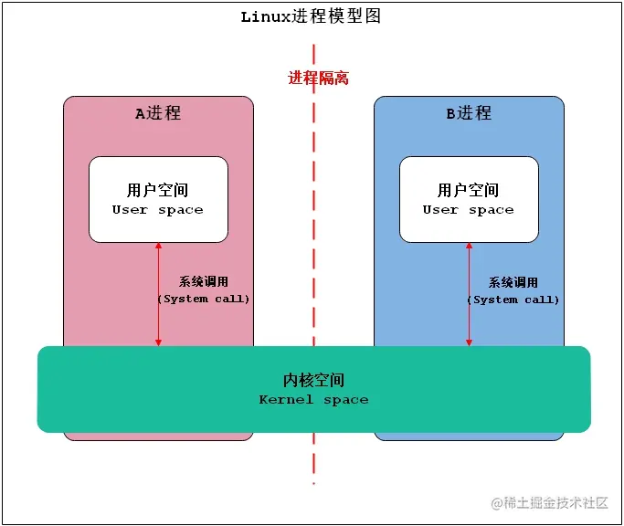

上面的图示向我们传递了 Linux 进程模型中几个非常重要的概念：

+   进程隔离
+   用户空间(User space)
+   内核空间(Kernel space)
+   系统调用(System call)

下面一一介绍这几个概念。

### 1.1.1 进程隔离

进程隔离简单的说就是 Linux 操作系统设计的一种机制，使进程之间不能共享数据，保持各自数据的独立性，即A进程不能访问B进程数据，同理B进程也不能访问A进程数据。通过虚拟内存技术，达到 Linux 进程中数据不能共享，从而保持独立的功能。所以，Linux 进程之间要进行数据交互就得采用特殊的通信机制，即 IPC 通信！

### 1.1.2 Linux 虚拟内存

虚拟内存是计算机系统内存管理的一种技术。它使得应用程序认为它拥有连续可用的内存（一个连续完整的地址空间），而实际上，它通常是被分隔成多个物理内存碎片，还有部分暂时存储在外部磁盘存储器上，在需要时进行数据交换。 在没有虚拟内存的时候，程序完全被装载进物理内存中，那么 1G 的存储空间永远只能执行固定个数的应用程序，一旦内存占满，就要触发 swap 和磁盘交换数据。而且每个应用程序大小不一，比如程序 A 占 4M 空间，程序 B 需要 6M 空间，即使 A 被释放了，B 也无法使用这 4M 的空间。 而在虚拟内存中，首先并不是将程序所需所有数据一次性装载进内存，而是需要什么数据才会装载什么数据。其次，虚拟内存以页为单位 (常规 4KB) 同物理内存最小单位一致，那么就可以减少碎片化的问题，可以给程序分配 4KB 为单位的非连续的物理空间，但是虚拟内存中却看起来是连续的。

### 1.1.3 Linux 进程空间(内核空间和用户空间)

我们前面提到了虚拟内存的概念，而 Linux 进程空间就是通过虚拟内存来实现的。我们知道现在操作系统都是采用虚拟存储器，那么对32位操作系统而言，它的寻址空间（虚拟存储空间）为4G（2的32次方）。操心系统的核心是内核，独立于普通的应用程序，可以访问受保护的内存空间，也有访问底层硬件设备的所有权限。为了保证用户进程不能直接操作内核，保证内核的安全，操心系统将虚拟空间划分为两部分，一部分为内核空间，一部分为用户空间。 针对 Linux 操作系统而言，将最高的1G字节（从虚拟地址0xC0000000到0xFFFFFFFF），供内核使用，称为内核空间，而将较低的3G字节（从虚拟地址0x00000000到0xBFFFFFFF），供各个进程使用，称为用户空间。每个进程可以通过系统调用进入内核，因此，Linux 内核由系统内的所有进程共享。于是，从具体进程的角度来看，每个进程可以拥有4G字节的虚拟空间。

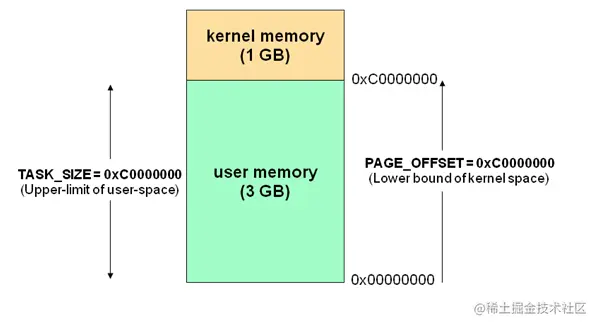

关于进程空间有如下几个点需要注意:

1.  内核空间中存放的是内核代码和数据，而进程的用户空间中存放的是用户程序的代码和数据。不管是内核空间还是用户空间，它们都处于虚拟内存中的(当然肯定会在实际使用中映射到实际的物理内存上面去的)。
2.  为了保证系统的安全，用户空间和内核空间是天然隔离的。
3.  内核空间是被所有的进程所共享的，这个从最上面的进程模型也可以看出来。
4.  为什么将进程空间划分为用户空间和内核空间呢，且之间有隔离，用户空间不能随意操作内核空间，主要是为了安全方面考虑，因为内核拥有对底层设备的所有访问权限，为了安全用户进程是不能直接访问内核进程的。

### 1.1.4 Linux 进程空间系统调用

虽然操作系统从逻辑上进行了用户空间和内核空间的划分，但不可避免的用户空间需要访问内核资源，比如文件操作、访问网络等等。为了突破隔离限制，就需要借助系统调用来实现。系统调用是用户空间访问内核空间的唯一方式，保证了所有的资源访问都是在内核的控制下进行的，避免了用户程序对系统资源的越权访问，提升了系统安全性和稳定性。 而在实际的操作中所有的系统资源管理都是在内核空间中完成的。比如读写磁盘文件，分配回收内存，从网络接口读写数据等等。我们的应用程序是无法直接进行这样的操作的。但是我们可以通过内核提供的接口来完成这样的任务这就是所谓的系统调用了。比如应用程序要读取磁盘上的一个文件，它可以向内核发起一个“系统调用”告诉内核：“我要读取磁盘上的某某文件”。其实就是通过一个特殊的指令让进程从用户态进入到内核态（到了内核空间），在内核空间中，CPU 可以执行任何的指令，当然也包括从磁盘上读取数据。具体过程是先把数据读取到内核空间中，然后再把数据拷贝到用户空间并从内核态切换到用户态。此时应用程序已经从系统调用中返回并且拿到了想要的数据，可以往下执行了。其切换的示意图如下：

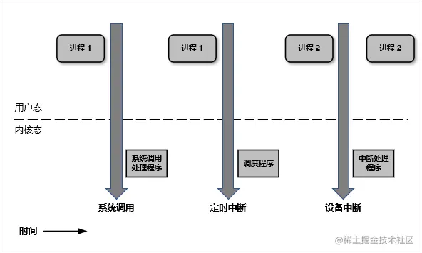

这里简单说下什么是内核态与用户态：

1.  当一个任务（进程）执行系统调用而陷入内核代码中执行时，称进程处于内核运行态（内核态）。此时处理器处于特权级最高的（0级）内核代码中执行。当进程处于内核态时，执行的内核代码会使用当前进程的内核栈。每个进程都有自己的内核栈。
2.  当进程在执行用户自己的代码时，则称其处于用户运行态（用户态）。此时处理器在特权级最低的（3级）用户代码中运行。当正在执行用户程序而突然被中断程序中断时，此时用户程序也可以象征性地称为处于进程的内核态。因为中断处理程序将使用当前进程的内核栈。

并且 Linux 使用两级保护机制：0级供系统内核使用，3级供用户程序使用。

### 1.1.5 Linux 进程空间跨进程通信常用的系统调用函数

我们先重点看下 Linux 进程空间是重点通过哪几个函数实现用户空间和内核空间的数据交互的。

#### 1.1.5.1 用户空间向内核空间传递数据常用函数

这里主要用到了两个函数，分别是 copy\_from\_user() 和 get\_user()，它们拷贝的数据流向如下：

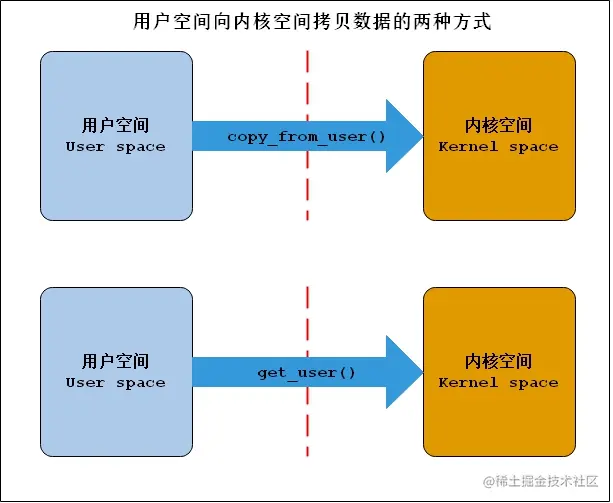

#### 1.1.5.2 内核空间向用户空间传递数据常用函数

这里主要用到了两个函数，分别是 copy\_to\_user() 和 put\_user()，它们拷贝的数据流向如下：

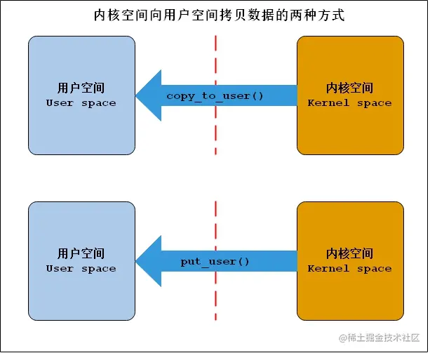

## 1.2 Linux 内存映射概念

内存映射是系统调用函数 mmap() 的中文翻译，其本质是一种进程虚拟内存的映射方法，它可以将一个文件、一段物理内存或者其它对象（也包括内核空间）映射到进程的虚拟内存地址空间。实现这样的映射关系后，进程就可以采用指针的方式来读写操作这一段内存，进而完成对文件(或者其它被映射的对象)的操作，而不必再调用 read/write 等系统调用函数了。所以正是因为有如上的特点内存映射能减少数据拷贝次数，实现用户空间和内核空间的高效互动。当映射成功以后，两个空间各自的修改能直接反映在映射的内存区域，从而被对方空间及时感知。也正因为如此，内存映射能够提供对进程间通信的支持。其模型如下所示：

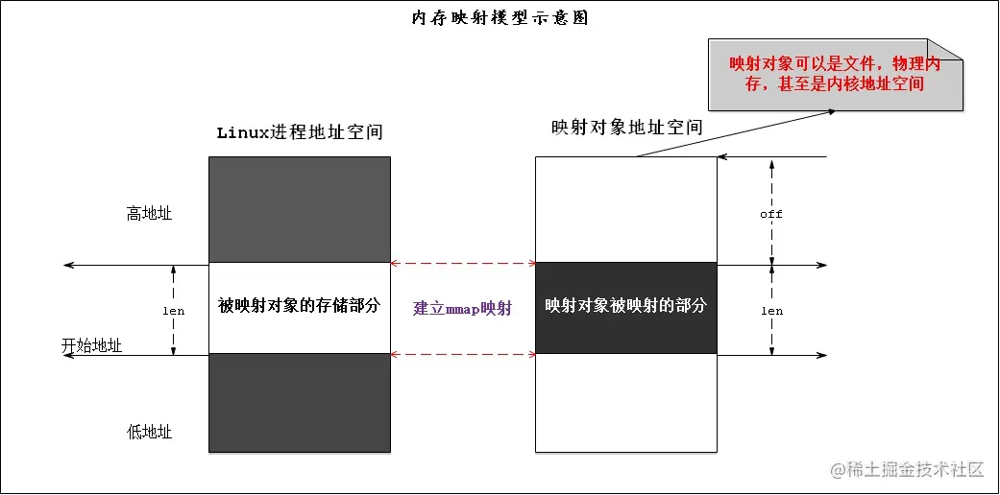

Binder 通信只拷贝一次的秘密武器就是它！这里我们先不带入 Binder 通信的概念，只重点了解一下内存映射的原理。

## 1.3 Linux 动态内核加载模块技术与Binder驱动简介

### 1.3.1 Linux 动态内核加载模块技术

通过前面理论知识的补充，我们知道了 Linux 进程空间中的用户空间和内核空间在绝大部分情况下是隔离的，它们之间的通信是可以通过系统调用来实现的。而传统的进程 IPC 通信模式都是借助内核来实现的，譬如管道，socket，消息队列等，而它们都已经作为 Linux 的内核一部分了，所以Linux 是天然支持如上几种 IPC 通信模式的。 但是我们的 Android 中引入的 Binder 通信概念中的 Binder 驱动并不是 Linux 系统标准内核的一部分，那怎么实现加载和使用呢？这就得益于 Linux 的动态内核可加载模块（Loadable Kernel Module，LKM）的机制；模块是具有独立功能的程序，它可以被单独编译，但是不能独立运行。它在运行时被链接到内核作为内核的一部分运行。这样，Android 系统就可以通过动态添加一个内核模块运行在内核空间，用户进程之间通过这个内核模块作为桥梁来实现通信。

### 1.3.2 Binder 驱动简介

Binder 驱动是一种虚拟的字符设备，重点它是虚拟出来的，尽管名叫“驱动”，实际上 Binder 驱动并没有操作相关的硬件，只是实现方式和设备驱动程序是一样的：它工作于内核态，提供open()，mmap()，poll()，ioctl()等标准文件操作，以字符驱动设备中的misc设备注册在设备目录/dev下，用户通过/dev/binder访问该它。如下所示：

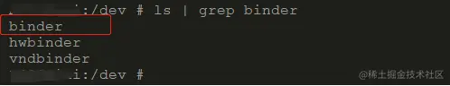

驱动负责进程之间 Binder 通信的建立，Binder 在进程之间的传递，Binder 引用计数管理，数据包在进程之间的传递和交互等一系列底层支持。驱动和应用程序之间定义了一套接口协议，主要功能由 ioctl() 接口实现，不提供 read()，write() 接口，因为 ioctl() 灵活方便，且能够一次调用实现先写后读以满足同步交互，而不必分别调用 write() 和 read()。 当然 Binder 驱动是 Android 特有的，所以它不是 Linux 标准内核携带的，必须通过动态内核加载进行加载的。既然 Binder 驱动属于内核层，所以应用层对于它访问也是通过系统调用实现的。

## 2 Linux 传统 IPC 通信原理和 Binder 通信原理

## 2.1 Linux 传统跨进程 IPC 通信原理

Linux 传统进程 IPC 通信由于 Linux 进程设计的原因，通常需要如下的步骤进行 IPC 通信(共享内存除外)：

+   对于消息的发送端进程：

1.  通常传统的 IPC 通信（Socket，管道，消息队列）首先将消息发送方将要发送的数据存放在内存缓存区中。
2.  然后通过前面所说系统调用进入内核态。然后操作系统为 Linux 发送方进程在内核空间分配内存，开辟一块内核缓存区，调用 copy\_from\_user() 函数将数据从用户空间的内存缓存区拷贝到内核空间的内核缓存区中。

+   对于消息的接收端进程：

1.  首先在进行接收数据时在自己的用户空间开辟一块内存缓存区。
2.  然后操作系统为 Linux 接收方进程在内核空间中调用 copy\_to\_user() 函数将数据从内核缓存区拷贝到接收进程的内存缓存区。这样数据发送方进程和数据接收方进程就完成了一次数据传输，我们称完成了一次进程间通信。

Linux 传统 IPC 通信的模型可以使用如下的示意图来完整表示，如下：

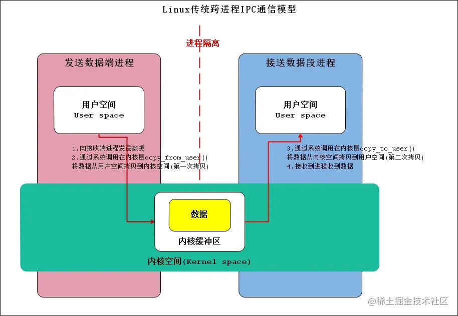

我们不难发现 Linux 传统跨进程 IPC 通信模型的缺点：

1.  传统 IPC 通信模型传输效率比较低，拷贝次数较多，需要两次（这个仅是对于 Binder 和匿名共享内存而言），第一次是从发送方用户空间拷贝到内核缓存区，第二次是从内核缓存区拷贝到接收方用户空间。
2.  接收数据的缓存区由数据接收进程提供，但是接收进程并不知道需要多大的空间来存放将要传递过来的数据，因此只能开辟尽可能大的内存空间或者先调用 API 接收消息头来获取消息体的大小，这两种做法不是浪费空间就是浪费时间。

## 2.2 Binder 跨进程 IPC 通信原理

前面我们知道了传统的 IPC 通信采用的是发送端 Linux 进程用户空间内存-区–>内核空间—>接收端 Linux 进程用户空间内存区的"两次拷贝"方式，那么 Binder 跨进程 IPC 通信是怎么做到了节约一次内存拷贝只需要一次的呢? 前面介绍 mmap 的时候有强调内存映射不仅可以将文件映射到进程的用户空间(从而减少数据的拷贝次数，用内存读写取代I/O读写，提高文件读取效率)，而且也可以将内核空间的一块区域映射到进程的用户空间。而 Binder 跨进程 IPC 通信正是借助了内存映射的方法，在内核空间和接收方用户空间的数据缓存区之间做了一层内存映射。这样一来，从发送方用户空间拷贝到内核空间缓存区的数据，就相当于直接拷贝到了接收方用户空间的数据缓存区，从而减少了一次数据拷贝。 一次完整的 Binder IPC 通信过程通常如下所示：

+   对于Binder服务端进程而言：

1.  Binder 服务端(Service)在启动之后，通过系统调用 Binde 驱动在内核空间创建一个数据接收缓存区（调用 binder\_oepn 方法执行相关的操作）。
2.  接着 Binder 服务端进程空间的内核接收到系统调用的指令，进而调用 binder\_mmap 函数进行对应的处理。首先申请一块物理内存，然后建立 Binder 服务端(Service端)的用户空间和内核空间一块区域的映射关系(这样上述两块区域就映射在一起了)。

+   对于请求端(Client)进程而言：

1.  Client 向服务端发送通信发送请求，这个请求数据打包完毕之后通过系统调用先到驱动中，然后在驱动中通过 copy\_from\_user() 将数据从用户空间拷贝到内核空间的缓存区中(注意这块内核空间和 Binder 服务端的用户空间存在映射关系)。
2.  由于内核缓存区和接收进程的用户空间存在内存映射，因此也就相当于把数据发送到了接收进程的用户空间（只需要进行一定的偏移操作即可），这样便完成了一次进程间的通信，从而省去了一次拷贝的操作。

Binder 跨进程 IPC 通信（数据传输）的模型可以使用如下的示意图来完整表示：

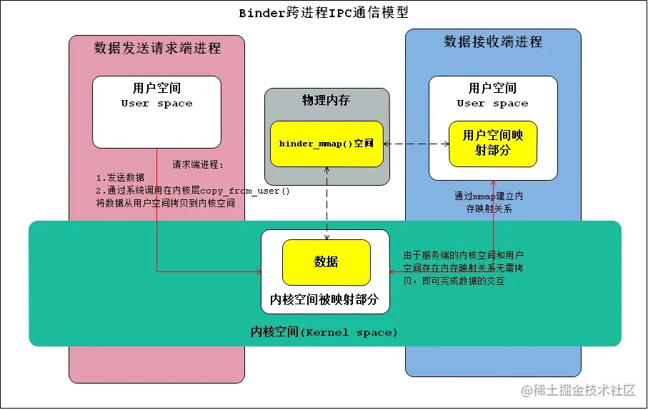

这里 Binder 就数据传入效率和资源包占用角度来说，相关传统的 IPC 通信有如下的优点：

1.  减少了数据的拷贝次数，用内存读写取代 I/O 读写，提高了文件读取效率。
2.  作为 Binder 服务端开辟的数据接收区大小是固定的（对于普通的 Binder 服务端和 servicemanager 端有一定的区别，都是都没有大于1M的空间）。

## 3 Binder 通信"一次拷贝"源码分析

参与 Binder 通讯的进程，无论是请求端还是服务器端，会在frameworks/base/cmds/app\_process/app\_main.cpp 中通过调用 ProcessState::self() 函数来建立自己的初步映射：

```cpp
virtual void onZygoteInit()
{
    sp<ProcessState> proc = ProcessState::self();
    ALOGV("App process: starting thread pool.\n");
    proc->startThreadPool();
}
```

本文分析的 Android Platform 源码基于 Android 11.0.0 分支，可以参考：

> [aospxref.com/android-11.…](http://aospxref.com/android-11.0.0_r21/ "http://aospxref.com/android-11.0.0_r21/")

Binder 驱动的代码在 ACK（Common Android Kernel） 中，基于 android11-5.4 分支分析，可以参考：

> [android.googlesource.com/kernel/comm…](https://android.googlesource.com/kernel/common/+/refs/heads/android11-5.4 "https://android.googlesource.com/kernel/common/+/refs/heads/android11-5.4")

涉及的源码路径如下（不同分支路径略有不同）：

> \--- kernel/drivers/android/binder.c  
> \--- kernel/drivers/android/binder\_alloc.c  
> \--- include/uapi/linux/android/binder.h  
> \--- frameworks/native/cmds/servicemanager/service\_manager.c  
> \--- frameworks/native/include/binder/Parcel.h  
> \--- frameworks/native/include/binder/IPCThreadState.h  
> \--- frameworks/native/libs/binder/IPCThreadState.cpp  
> \--- frameworks/native/include/binder/ProcessState.h  
> \--- frameworks/native/libs/binder/ProcessState.cpp

## 3.1 Binder 服务端（接收）进程建立内存映射

Binder 内存映射建立是从 ProcessState::self() 函数开始，该函数使用典型的单列模式：如已创建该实例则直接返回，如果没有创建，则创建返回这个实例，这里需要锁来防止创建两个同类型的实例，该函数还是 static 类型的，所以可以在系统的任何地方调用。

```cpp
#ifdef __ANDROID_VNDK__
const char* kDefaultDriver = "/dev/vndbinder";
#else
const char* kDefaultDriver = "/dev/binder";
#endif

sp<ProcessState> ProcessState::self()
{
   Mutex::Autolock _l(gProcessMutex);
    if (gProcess != nullptr) {
        return gProcess;
    }
    gProcess = new ProcessState(kDefaultDriver);
    return gProcess;
}
```

接着看 ProcessState 的构造方法，如下：

```cpp
#define BINDER_VM_SIZE ((1 * 1024 * 1024) - sysconf(_SC_PAGE_SIZE) * 2)

ProcessState::ProcessState(const char *driver)
    : mDriverName(String8(driver))
    , mDriverFD(open_driver(driver))
    , mVMStart(MAP_FAILED)
    , mThreadCountLock(PTHREAD_MUTEX_INITIALIZER)
    , mThreadCountDecrement(PTHREAD_COND_INITIALIZER)
    , mExecutingThreadsCount(0)
    , mMaxThreads(DEFAULT_MAX_BINDER_THREADS)
    , mStarvationStartTimeMs(0)
    , mBinderContextCheckFunc(nullptr)
    , mBinderContextUserData(nullptr)
    , mThreadPoolStarted(false)
    , mThreadPoolSeq(1)
    , mCallRestriction(CallRestriction::NONE)
{

// TODO(b/139016109): enforce in build system
#if defined(__ANDROID_APEX__)
    LOG_ALWAYS_FATAL("Cannot use libbinder in APEX (only system.img libbinder) since it is not stable.");
#endif

    if (mDriverFD >= 0) {
        // mmap the binder, providing a chunk of virtual address space to receive transactions.
        mVMStart = mmap(nullptr, BINDER_VM_SIZE, PROT_READ, MAP_PRIVATE | MAP_NORESERVE, mDriverFD, 0);
        if (mVMStart == MAP_FAILED) {
            // *sigh*
            ALOGE("Using %s failed: unable to mmap transaction memory.\n", mDriverName.c_str());
            close(mDriverFD);
            mDriverFD = -1;
            mDriverName.clear();
        }
    }

#ifdef __ANDROID__
    LOG_ALWAYS_FATAL_IF(mDriverFD < 0, "Binder driver '%s' could not be opened.  Terminating.", driver);
#endif
}
```

可以看到在 ProcessState 的构造函数中，它有进行一系列的初始化。其中比较重要的有如下两步：

+   通过 open\_driver() 打开"/open/binder"，并将文件句柄赋值给 mDriverFD。
+   通过调用 mmap() 映射内存，最后会通过系统调用内核空间驱动的 binder\_mmap() 函数。这里我们分析下 mmap() 的入参：
    +   第一个参数是映射内存的起始地址，0代表让系统自动选定地址；
    +   mapsize 表示映射空间的大小，这里的取值是1M-8K；
    +   PROT\_READ 表示映射区域是可读的；
    +   MAP\_PRIVATE 表示建立一个写入时拷贝的私有映射，内存区域的写入不会影响到原文件。MAP\_NORESERVE 表示不要为这个映射保留交换空间。
    +   mDriverFD 是"/dev/binder"句柄；
    +   而0表示偏移；

那么，是不是所有的 Binder 进程映射的内存空间大小都是固定的呢？比如这里的1M-8K大小！答案是否定的，因为有一个特例就是 servicemanager 进程，它的 Binder 映射空间大小只有128K，我们可以通过如下的命令来验证一下：

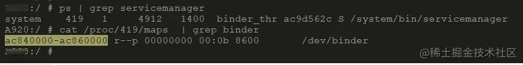

```powershell
xxx:/ # ps | grep servicemanager
system    419   1     4912   1400  binder_thr ac9d562c S /system/bin/servicemanager
xxx:/ # cat /proc/419/maps  | grep binder
ac840000-ac860000 r--p 00000000 00:0b 8600       /dev/binder
xxx:/ #
```

根据虚拟地址长度计算 servicemanager 进程的 Binder 映射空间大小为128K。

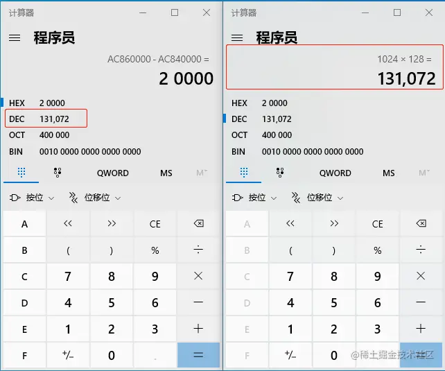 我们再看下普通进程的 Binder 地址长度，这里我们以 mediaserver 为例说明，如下：

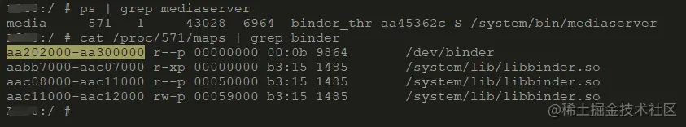

```powershell
xxx:/ # ps | grep mediaserver
media     571   1     43028  6964  binder_thr aa45362c S /system/bin/mediaserver
xxx:/ # cat /proc/571/maps | grep binder
aa202000-aa300000 r--p 00000000 00:0b 9864       /dev/binder
aabb7000-aac07000 r-xp 00000000 b3:15 1485       /system/lib/libbinder.so
aac08000-aac11000 r--p 00050000 b3:15 1485       /system/lib/libbinder.so
aac11000-aac12000 rw-p 00059000 b3:15 1485       /system/lib/libbinder.so
xxx:/ #
```

我们来验证一下被映射的 Binder 地址空间大小是不是1M-8K：

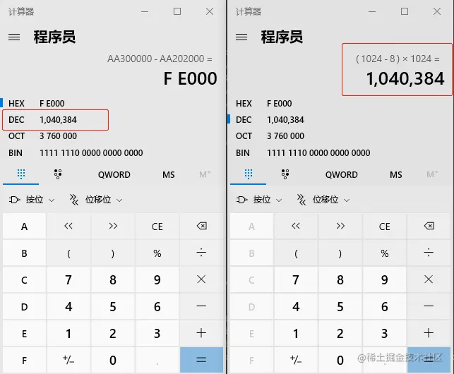

## 3.2 内核空间对 Binder 映射的处理

通过前面我们知道进程空间的用户空间 mmap 操作最后会通过系统调用到内核空间的 binder\_mmap() 中去，先看下 binder\_mmap() 函数的定义，如下：

```c
static int binder_mmap(struct file *filp, struct vm_area_struct *vma);
```

其中 struct vm\_area\_struct \*vma 就是内核为我们找到的用户空间的进程虚拟内存区域，这就是驱动程序需要映射到设备内存的地址。而该参数的 vma->vm\_start 和 vma->vm\_end 即为此次映射内核为我们分配的开始地址和结束地址，他们差值就是系统调用 mmap 中的 length 的值。而 vma->vm\_start 的则是系统调用 mmap 调用的返回值。需要注意的是 vma->vm\_start和vma->vm\_end 都是调用进程的用户空间的虚拟地址，他们地址范围可以通过如下命令：cat /proc/pid/maps | grep "/dev/binder"看到，如上图所示 mediaserver 进程对应的 vma->vm\_start 和 vma->vm\_end 的值分别为：aa202000和 aa300000。 下面来看 binder\_mmap() 的源码实现：

```c
static int binder_mmap(struct file *filp, struct vm_area_struct *vma)
{
	int ret;
	struct binder_proc *proc = filp->private_data;
	const char *failure_string;
    //校验进程信息
	if (proc->tsk != current->group_leader)
		return -EINVAL;
	binder_debug(BINDER_DEBUG_OPEN_CLOSE,
		     "%s: %d %lx-%lx (%ld K) vma %lx pagep %lx\n",
		     __func__, proc->pid, vma->vm_start, vma->vm_end,
		     (vma->vm_end - vma->vm_start) / SZ_1K, vma->vm_flags,
		     (unsigned long)pgprot_val(vma->vm_page_prot));
    //检查用户空间是否可写（FORBIDDEN_MMAP_FLAGS == VM_WRITE）
	if (vma->vm_flags & FORBIDDEN_MMAP_FLAGS) {
		ret = -EPERM;
		failure_string = "bad vm_flags";
		goto err_bad_arg;
	}
    //VM_DONTCOPY表示此vma不可被fork所复制
	vma->vm_flags |= VM_DONTCOPY | VM_MIXEDMAP;
    //用户空间不可设置该vma的VM_WRITE标志
	vma->vm_flags &= ~VM_MAYWRITE;
    //设置此vma操作函数集
	vma->vm_ops = &binder_vm_ops;
    //指向binder_proc
	vma->vm_private_data = proc;
    //处理进程虚拟内存空间与内核虚拟地址空间的映射关系
	ret = binder_alloc_mmap_handler(&proc->alloc, vma);
	if (ret)
		return ret;
	return 0;
err_bad_arg:
	pr_err("%s: %d %lx-%lx %s failed %d\n", __func__,
	       proc->pid, vma->vm_start, vma->vm_end, failure_string, ret);
	return ret;
}
```

这里调用了 binder\_alloc.c 的 binder\_alloc\_mmap\_handler() 函数：

```c
int binder_alloc_mmap_handler(struct binder_alloc *alloc,
			      struct vm_area_struct *vma)
{
	int ret;
	const char *failure_string;
	struct binder_buffer *buffer;
    //加锁
	mutex_lock(&binder_alloc_mmap_lock);
	if (alloc->buffer_size) {
		ret = -EBUSY;
		failure_string = "already mapped";
		goto err_already_mapped;
	}
	alloc->buffer_size = min_t(unsigned long, vma->vm_end - vma->vm_start,
				   SZ_4M);
    //释放锁
	mutex_unlock(&binder_alloc_mmap_lock);
	alloc->buffer = (void __user *)vma->vm_start;
    //分配物理页的指针数组，数组大小为vma的等效page个数
	alloc->pages = kcalloc(alloc->buffer_size / PAGE_SIZE,
			       sizeof(alloc->pages[0]),
			       GFP_KERNEL);
	if (alloc->pages == NULL) {
		ret = -ENOMEM;
		failure_string = "alloc page array";
		goto err_alloc_pages_failed;
	}
    //为buffer分配物理内存
	buffer = kzalloc(sizeof(*buffer), GFP_KERNEL);
	if (!buffer) {
		ret = -ENOMEM;
		failure_string = "alloc buffer struct";
		goto err_alloc_buf_struct_failed;
	}
    //物理内存binder->user_data指向虚拟内存alloc->buffer
	buffer->user_data = alloc->buffer;
    //将binder_buffer地址，加入到所属进程的buffers队列
	list_add(&buffer->entry, &alloc->buffers);
	buffer->free = 1;
    // 把分配好的内存插入到对应的表中（空闲内存表）
	binder_insert_free_buffer(alloc, buffer);
    //异步可用空间大小为buffer总大小的一半
	alloc->free_async_space = alloc->buffer_size / 2;
    // 将用户空间地址信息保存到alloc中
	binder_alloc_set_vma(alloc, vma);
	mmgrab(alloc->vma_vm_mm);
	return 0;
err_alloc_buf_struct_failed:
	kfree(alloc->pages);
	alloc->pages = NULL;
err_alloc_pages_failed:
	alloc->buffer = NULL;
	mutex_lock(&binder_alloc_mmap_lock);
	alloc->buffer_size = 0;
err_already_mapped:
	mutex_unlock(&binder_alloc_mmap_lock);
	binder_alloc_debug(BINDER_DEBUG_USER_ERROR,
			   "%s: %d %lx-%lx %s failed %d\n", __func__,
			   alloc->pid, vma->vm_start, vma->vm_end,
			   failure_string, ret);
	return ret;
}
```

这里可以看到 binder\_mmap 的作用是进行内存映射。当应用调用到内存的 binder\_mmap() 映射内存到进程虚拟地址时，该函数会进行两个操作：

1.  将指定大小的"物理内存" 映射到 “用户空间”（即进程的虚拟地址中）
2.  将该“物理内存”也映射到“内核空间(即，内核的虚拟地址中)”。简单来说，就是“将进程虚拟地址空间和内核虚拟地址空间映射同一个物理页面”

这样在 Binder 通信机制中，binder\_mmap() 会将 Server 进程的虚拟地址和内核虚拟地址映射到同一个物理页面。那么当 Client 进程向 Server 进程发送请求时，只需要将 Client 的数据拷贝到内核空间即可！由于 Server 进程的地址和内核空间映射到同一个物理页面，因此，Client 中的数据拷贝到内核空间时，也就相当于拷贝到了 Server 进程中。因此，Binder 通信机制中，数据传输时，只需要1次内存拷贝！这就是 Binder 通信原理的精髓所在！

## 3.3 Binder 请求端进程数据传输过程

一次完整的 Binder 传输需要涉及到发送端和接收端进程，我们先从请求端进程开始分析。

### 3.3.1 Binder 请求端用户空间对传输数据的处理

在进程的用户空间，我们知道 Binder 数据最后都会统一通过 IPCThreadState::writeTransactionData 对传入的数据进行处理，我们看下它对传入数据的处理逻辑，如下：

```cpp
status_t IPCThreadState::writeTransactionData(int32_t cmd, uint32_t binderFlags,
    int32_t handle, uint32_t code, const Parcel& data, status_t* statusBuffer)
{
    binder_transaction_data tr;

    tr.target.ptr = 0; /* Don't pass uninitialized stack data to a remote process */
    tr.target.handle = handle;
    tr.code = code;
    tr.flags = binderFlags;
    tr.cookie = 0;
    tr.sender_pid = 0;
    tr.sender_euid = 0;

    const status_t err = data.errorCheck();
    if (err == NO_ERROR) {
        tr.data_size = data.ipcDataSize();//数据大小(对应mDataSize)
        tr.data.ptr.buffer = data.ipcData();//数据的起始地址(对应mData)
        tr.offsets_size = data.ipcObjectsCount()*sizeof(binder_size_t);// data中保存的对象个数(对应mObjectsSize)
        tr.data.ptr.offsets = data.ipcObjects();// data中保存的对象的偏移地址数组(对应mObjects)
    } else if (statusBuffer) {
        tr.flags |= TF_STATUS_CODE;
        *statusBuffer = err;
        tr.data_size = sizeof(status_t);
        tr.data.ptr.buffer = reinterpret_cast<uintptr_t>(statusBuffer);
        tr.offsets_size = 0;
        tr.data.ptr.offsets = 0;
    } else {
        return (mLastError = err);
    }
    // 将tr写入mOut。
    mOut.writeInt32(cmd);
    mOut.write(&tr, sizeof(tr));

    return NO_ERROR;
}
```

这里的 binder\_transaction\_data 数据结构存储的是相关 Binder 传入的数据和一些相关的控制指令，然后被统一打包到了 Parcel 实例对象 mOut 中去了，Binder 要传输的数据打包完毕后，发送端进程会调用 IPCThreadState::talkWithDriver 函数继续处理数据：

```cpp
status_t IPCThreadState::talkWithDriver(bool doReceive)
{
	...
    binder_write_read bwr;
	...
    bwr.write_size = outAvail;
    bwr.write_buffer = (uintptr_t)mOut.data();

    // 这里我们先暂且忽略发送端读取数据涉及的数据交互
    if (doReceive && needRead) {
        bwr.read_size = mIn.dataCapacity();
        bwr.read_buffer = (uintptr_t)mIn.data();
    } else {
		...
    }
	....
    bwr.write_consumed = 0;
    bwr.read_consumed = 0;
    status_t err;
.	...
	//调用ioctl，然后通过系统调用到binder_ioctl
    if (ioctl(mProcess->mDriverFD, BINDER_WRITE_READ, &bwr) >= 0)
    ...
    return err;
}
```

这里就是对前面封装的 binder\_transaction\_data 的数据又进行了一次封装，使用的是 binder\_write\_read 数据结构实例对象 bwr。其中 bwr.write\_buffer 保存了指向 mOut.data() 的指针，通过前面内容我们也知道指向了前面的 binder\_transaction\_data 对象实例 tr。

### 3.3.2 Binder 请求端用户空间对传输数据的处理

最终 ioctl 对通过系统调用到内核层的 binder\_ioctl 进行下一步的处理，我们接着往下看（第一次拷贝要出现了）。

```c
static long binder_ioctl(struct file *filp, unsigned int cmd, unsigned long arg)
{
	...
	void __user *ubuf = (void __user *)arg;

	....
	switch (cmd) {
	case BINDER_WRITE_READ: {
		ret = binder_ioctl_write_read(filp, cmd, arg, thread);
		if (ret)
			goto err;
		break;
        ...
	}
	...
}
```

重点看下 binder\_ioctl\_write\_read() 函数：

```c
static int binder_ioctl_write_read(struct file *filp,
				unsigned int cmd, unsigned long arg,
				struct binder_thread *thread)
{
	int ret = 0;
	struct binder_proc *proc = filp->private_data;
	unsigned int size = _IOC_SIZE(cmd);
	void __user *ubuf = (void __user *)arg;
	struct binder_write_read bwr;
	if (size != sizeof(struct binder_write_read)) {
		ret = -EINVAL;
		goto out;
	}
    /* 
		第一次拷贝，将ubuf的数据从用户空间拷贝到内核空间bwr中
		注意此时的ubuf表示的是binder_write_read数据结构，即把它从“用户空间”拷贝到“内核空间”
	*/
	if (copy_from_user(&bwr, ubuf, sizeof(bwr))) {
		ret = -EFAULT;
		goto out;
	}
    //write_size大于0，表示用户进程有数据发送到驱动
	if (bwr.write_size > 0) {
        //发送数据
		ret = binder_thread_write(proc, thread,
					  bwr.write_buffer,
					  bwr.write_size,
					  &bwr.write_consumed);
		trace_binder_write_done(ret);
		if (ret < 0) {
			bwr.read_consumed = 0;
			if (copy_to_user(ubuf, &bwr, sizeof(bwr)))
				ret = -EFAULT;
			goto out;
		}
	}
	...
out:
	return ret;
}
```

这里出现了第一个 copy\_from\_user() 调用，通过这个调用会把用户空间的 bwr 指向的数据给拷贝到内核空间中。copy\_from\_user() 的第一个入参是拷贝的目标地址，这里给的是&bwr，bwr 是 binder\_write\_read 的实例对象，是对 Binder 传输数据的最外层封装 ，所以此时还是没有和服务端被映射的内存关联上。 此处的从用户空间拷贝到内核空间的数据 bwr 是前面我们在用户空间封装的协议的最外层，并不是发送端进程真正要传递的数据，它封装的是一些传入协议，如果真的要说 bwr 中携带了要传递的数据那也就是存储了指向 binder\_transaction\_data 的指针信息。事实上，对于 Binder 传递的数据内核中是分段多次拷贝的，所以给人造成一种感觉就是执行了多次拷贝。 接下来就进入 binder\_thread\_write。其中涉及到数据传入的参数 bwr.write\_buffer，这里指向的是用户空间的 binder\_transaction\_data 实例对象 tr。

```c
static int binder_thread_write(struct binder_proc *proc,
			struct binder_thread *thread,
			binder_uintptr_t binder_buffer, size_t size,
			binder_size_t *consumed)
{
	uint32_t cmd;
	void __user *buffer = (void __user *)(uintptr_t)binder_buffer;
	void __user *ptr = buffer + *consumed;
	void __user *end = buffer + size;
	while (ptr < end && thread->return_error == BR_OK) {
		//从用户空间获取write_buffer指向的内存数据
		if (get_user(cmd, (uint32_t __user *)ptr))
			return -EFAULT;
		ptr += sizeof(uint32_t);
		...
		switch (cmd) {
			...
			case BC_TRANSACTION:
			case BC_REPLY: {
				struct binder_transaction_data tr;
				//这里又有一次拷贝
				if (copy_from_user(&tr, ptr, sizeof(tr)))
					return -EFAULT;
				ptr += sizeof(tr);
				binder_transaction(proc, thread, &tr, cmd == BC_REPLY);
				break;
			}		
			...
		}
	}
}
```

这里出现了第二个 copy\_from\_user()，通过这次拷贝会把用户空间的那个 tr，也就是IPCThreadState.mOut，给拷贝到内核中来（注意此时 binder\_transaction\_data 并没有真正的存储要传输“实际数据”，它也是对 Binder 数据的一层封装而已，它的 data 指针指向了真正的数据），所以此时还是没有和服务端被映射的内存关联上，我们继续往下分析 binder\_transaction() 函数：

```c
static void binder_transaction(struct binder_proc *proc,
			       struct binder_thread *thread,
			       struct binder_transaction_data *tr, int reply)
{
	//Binder事务
	struct binder_transaction *t;
	...
	t->sender_euid = proc->tsk->cred->euid;
	t->to_proc = target_proc;//事务的目标进程
	t->to_thread = target_thread;//事务的目标线程
	t->code = tr->code;//事务代码
	t->flags = tr->flags;
	t->is_nested = is_nested;
    //设置优先级
    if (!(t->flags & TF_ONE_WAY) &&
	    binder_supported_policy(current->policy)) {
		/* Inherit supported policies for synchronous transactions */
		t->priority.sched_policy = current->policy;
		t->priority.prio = current->normal_prio;
	} else {
		/* Otherwise, fall back to the default priority */
		t->priority = target_proc->default_priority;
	}
    ...
	trace_binder_transaction(reply, t, target_node);
    //分配缓存，建立映射
	t->buffer = binder_alloc_new_buf(&target_proc->alloc, tr->data_size,//从target进程的binder内存空间分配所需的内存大小（tr->data_size+tr->offsets_size），并且分配好的空间是已经被映射好的
		tr->offsets_size, extra_buffers_size,
		!reply && (t->flags & TF_ONE_WAY), current->tgid);
	...
	t->buffer->debug_id = t->debug_id;
	t->buffer->transaction = t;//该binder_buffer对应的事务	
	t->buffer->target_node = target_node;//该事务对应的目标binder实体
	t->buffer->clear_on_free = !!(t->flags & TF_CLEAR_BUF);
    trace_binder_transaction_alloc_buf(t->buffer);
    //分配buffer，拷贝用户数据到buffer里面
	if (binder_alloc_copy_user_to_buffer(
				&target_proc->alloc,
				t->buffer, 0,
				(const void __user *)
					(uintptr_t)tr->data.ptr.buffer,
				tr->data_size)) {
		...
	}
    //分配buffer，拷贝用户数据到buffer里面，根据data.ptr.offsets，找出传输数据里面Binder数据
	if (binder_alloc_copy_user_to_buffer(
				&target_proc->alloc,
				t->buffer,
				ALIGN(tr->data_size, sizeof(void *)),
				(const void __user *)
					(uintptr_t)tr->data.ptr.offsets,
				tr->offsets_size)) {
		...
	}
	...
}
```

这里调用了两次 binder\_alloc.c 的 binder\_alloc\_copy\_user\_to\_buffer() 函数：

```c
unsigned long
binder_alloc_copy_user_to_buffer(struct binder_alloc *alloc,
				 struct binder_buffer *buffer,
				 binder_size_t buffer_offset,
				 const void __user *from,
				 size_t bytes)
{
	if (!check_buffer(alloc, buffer, buffer_offset, bytes))
		return bytes;
	while (bytes) {
		unsigned long size;
		unsigned long ret;
		struct page *page;
		pgoff_t pgoff;
		void *kptr;
		page = binder_alloc_get_page(alloc, buffer,
					     buffer_offset, &pgoff);
		size = min_t(size_t, bytes, PAGE_SIZE - pgoff);
		kptr = kmap(page) + pgoff;
		ret = copy_from_user(kptr, from, size);
		kunmap(page);
		if (ret)
			return bytes - size + ret;
		bytes -= size;
		from += size;
		buffer_offset += size;
	}
	return 0;
}
```

在这里调用了 copy\_from\_user() 函数。所以共有两次 copy 的操作：

1.  其中一次是 copy parcel 的 data 数据操作，此次就是把发起方用户空间的数据直接拷贝到了接收方内核的内存映射中，这就是所谓“一次拷贝”的关键点。
2.  另外一次 copy parcel 里 flat\_binder\_object 的偏移地址的数据，所以这里我们就将就认为"一次拷贝"就指代这里吧。这里就把发送端进程从用户空间传递过来的数据(parcel 打包） copy 到内核空间了。而且这个内核空间的内存是接收服务端端提供的，更加重要的是这个块内核空间还和接收端进程的用户空间共同映射到了同一块物理内存上了，这样接收端就不需要再进行一次拷贝将数据从内核空间拷贝到用户空间了。

上述流程处理完毕之后，Binder 驱动内核空间会将该次事务放到接收端线程所在的 todo 列表中，然后唤醒接收端目标线程对传输的数据进行下一步处理。

## 3.4 Binder 服务（接收）端进程数据传输过程

Binder 服务端进程在添加 Binder 服务到 servicemanager 进程以后，会开启 loop 循环然后阻塞在 binder\_thread\_read 函数中的 thread->wait 等待队列上的目标线程，由于此时有事务的到来会被被唤醒，唤醒后从自己的 thread->todo 双向列表中取出在 binder\_transaction() 函数放入到该队列的事务（struct binder\_transaction），并用这个结构体来初始化 struct binder\_transaction\_data 结构体。

### 3.4.1 Binder 服务（接收端）内核空间对传输数据的处理

如果说前面发送的流程是从用户空间通过系统调用到内核空间，那么接收端则是相反的是先从内核空间开始处理的。这里我们来看下接收端进程内核中的处理流程，即调用 binder\_thread\_read 读取数据。

```c
static int binder_thread_read(struct binder_proc *proc,
			      struct binder_thread *thread,
			      binder_uintptr_t binder_buffer, size_t size,
			      binder_size_t *consumed, int non_block)
{
    ...
    struct binder_transaction_data_secctx tr;
	struct binder_transaction_data *trd = &tr.transaction_data;
    struct binder_transaction *t = NULL;
	...

	trd->data_size = t->buffer->data_size;//事务对应的数据的大小
	trd->offsets_size = t->buffer->offsets_size;	
	//得到事务对应的内核数据在用户空间的访问地址
	trd->data.ptr.buffer = (uintptr_t)t->buffer->user_data;
	//得到事务对应的数据在用户空间的访问地址
	trd->data.ptr.offsets = trd->data.ptr.buffer +
					ALIGN(t->buffer->data_size,
					    sizeof(void *));
	tr.secctx = t->security_ctx;
	if (t->security_ctx) {
		cmd = BR_TRANSACTION_SEC_CTX;
		trsize = sizeof(tr);
	}
	if (put_user(cmd, (uint32_t __user *)ptr)) {//拷贝返回命令
        ...
		return -EFAULT;
    }
	ptr += sizeof(uint32_t);
	//注意：只是拷贝了命令对应的固定大小的tr参数，并没有拷贝tr.data.ptr.buffer指向的内容
	if (copy_to_user(ptr, &tr, trsize)) {
		...
        return -EFAULT;
	}
}
```

这里出现了第一个 copy\_to\_user() 调用，这里是把前面发送端进程传递过来的事务 binder\_transaction\_data 实例对象 tr 给拷贝到接收方的用户空间的 binder\_write\_read.read\_buffer 中（在此之前把内核映射的数据地址指针转换为用户空间的指针赋值给tr.data.ptr.buffer），所以此时我们的接收端进程的用户空间可以直接使用 tr.data.ptr.buffer 的值就可以访问到远端传递过来的数据，而不需要继续做拷贝动作将内核的数据通过 copy\_to\_user 来拷贝到用户空间，同样的道理用户空间直接使用 tr.data.ptr.offsets 的值就可以直接访问 binder 对象的偏移数组。 此处接收端进程可以和前面发送端进程拷贝进行对比，对于发送端进程需要从用户空间向内核空间拷贝如下四个数据：

1.  binder\_write\_read
2.  binder\_transaction\_data
3.  copy parcel的data数据操作
4.  copy parcel里flat\_binder\_object的偏移地址的数据

而对于接收端进程而言，只要进行前面两次拷贝就可以了，后面两个通过内存映射的方式省去了。 接着接收端进程从 binder\_thread\_read 函数中返回，调用 binder\_ioctl 方法继续下一步的处理：

```c
static long binder_ioctl(struct file *filp, unsigned int cmd, unsigned long arg)
{
	...
	void __user *ubuf = (void __user *)arg;
	....
	switch (cmd) {
	case BINDER_WRITE_READ:
		ret = binder_ioctl_write_read(filp, cmd, arg, thread);
		if (ret)
			goto err;
		break;
	...
}
```

接着看 binder\_ioctl\_write\_read() 函数：

```c
static int binder_ioctl_write_read(struct file *filp,
				unsigned int cmd, unsigned long arg,
				struct binder_thread *thread)
{
    ...
	if (bwr.read_size > 0) {
		//接收端进程调用binder_thread_read
		ret = binder_thread_read(proc, thread, bwr.read_buffer, bwr.read_size, &bwr.read_consumed, filp->f_flags & O_NONBLOCK);
		...
	}

	if (copy_to_user(ubuf, &bwr, sizeof(bwr))) {
		ret = -EFAULT;
		goto err;
	}
    ...
}
```

在这里出现了第二个 copy\_to\_user()，它的功能主要是将把内核空间的 bwr 拷贝回用户空间的 ubuf 中（注意此时 bwr 内包含指向 tr 的指针，也就是 bwr.read\_buffer 是指向这个 tr，或者说IPCThreadState.mIn）。如上流程执行完毕以后就会回到接收端的用户空间接着调用 IPCThreadState::executeCommand 执行下一步的处理逻辑。

### 3.4.2 Binder 服务（接收端）用户空间对传输数据的处理

直接上源码看看 IPCThreadState::executeCommand 的处理逻辑，如下：

```cpp
status_t IPCThreadState::executeCommand(int32_t cmd)
{
	...
	case BR_TRANSACTION:
	        {
	            binder_transaction_data_secctx tr_secctx;
	            binder_transaction_data& tr = tr_secctx.transaction_data;
	            if (cmd == (int) BR_TRANSACTION_SEC_CTX) {
                    result = mIn.read(&tr_secctx, sizeof(tr_secctx));
                } else {
                    result = mIn.read(&tr, sizeof(tr));
                    tr_secctx.secctx = 0;
                }
	            ...
	            Parcel buffer;
	            buffer.ipcSetDataReference(
	                reinterpret_cast<const uint8_t*>(tr.data.ptr.buffer),
	                tr.data_size,
	                reinterpret_cast<const binder_size_t*>(tr.data.ptr.offsets),
	                tr.offsets_size/sizeof(binder_size_t), freeBuffer, this);
	            ...        
	
	          error = reinterpret_cast<BBinder*>(tr.cookie)->transact(tr.code, buffer, &reply, tr.flags);
	       }                    
	...
}
```

在该源码主要执行了如下的逻辑：

1.  首先把 binder\_transaction\_data 从 mIn 里面读出来。
2.  然后就直接就把内存映射过来的指针 tr.data.ptr.buffer 也就是那“一次拷贝”过来的地址赋值给 buffer 这个 Parcel。

这样后续的实体 Binder 就可以调用 transact 来处理发起方传过来的数据了。至此 Android Binder 通信的"一次拷贝"的原理就结束了。

## 4 总结

从上面的源码分析中可以看到，所谓的 Binder 的一次拷贝数据指的是：在两个进程通过 Binder 驱动传输数据的时候，首先需要将数据从发送进程的用户空间拷贝到内核空间，在内核之间传递数据的时候，由于 Binder 驱动直接从目标进程的内核对应的虚拟内存空间开始分配的内存空间&&目标进程的内核空间和进程的虚拟内存空间的内存映射关系，所以从发送进程对应的内核的虚拟内存空间拷贝到 Binder 驱动的内存空间，相当于直接拷贝到了目标进程的用户空间中。内存映射就是 Binder 通信一次拷贝的关键所在。

## 5 REF

转载自 [Android Binder 通信一次拷贝的原理](https://juejin.cn/post/7176465663173607483)