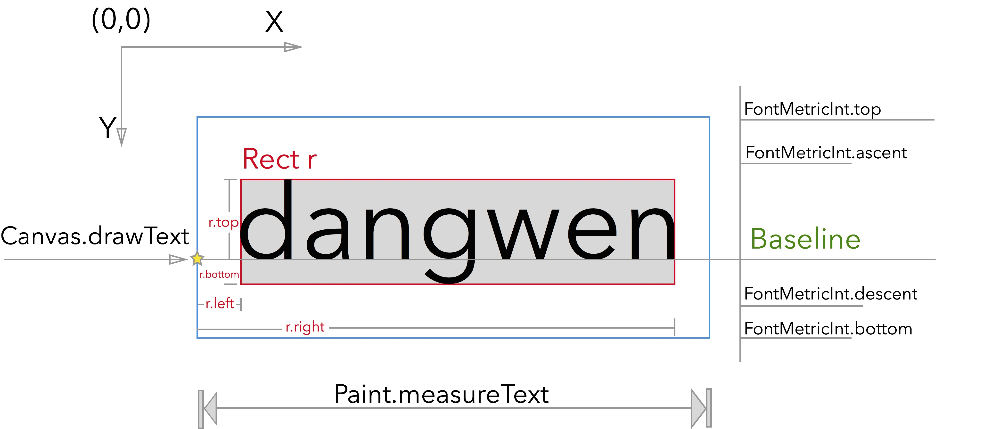

用Canvas的draw***方法去绘制图像图形，绘制的坐标一般是从Canvas左上角开始计算的，如果想要把一个图像放到某个位置，直接drawBitmap传递图片左上角的坐标即可。
但是drawText不一样，如果你传递进去字符串，会发现文字的位置和你指定的不一样。

源码是native方法，没法直接看

<!-- ’ -->
 

## Paint.getTextBounds:
当你通过这个方法来获取尺寸的时候，你可以得到能够包裹文字的最小矩形，就是图中红色边框的那部分，你可以得到一个Rect对象，包含这个最小尺寸的几个值。

**注：这里的Rect对象坐标并不是以左上角为准的，而是相对于左边中间靠下位置的一个点，就是图中的黄色五角星。而这里水平的Baseline指的是字符串对齐的一条线。既然这样，r.top就是一个负值了，r.bottom会是一个小一点的正值，r.left和r.right在图中画的都很清楚。通过r.width()和r.height()来获取尺寸。**

那么文字的偏移就好说了，比如说你要把文字画在Canvas的左上角，坐标是(0,0)，但是当你通过：
```java
canvas.drawText(“dangwen”,0,0,paint);
```
来画文字的时候，发现只有文字的下半部分画出来了，因为你传递进去的参数应该是以Baseline为标准的，正确的方法是：
```java
canvas.drawText(“dangwen”,-r.left,-r.top,paint);
```

## Paint.getFontMetricsInt()
当你通过这里方法来获取尺寸的时候，你获取的只是一个垂直方向上的尺寸，这里的ascent代表的是字体的上部，descent代表的是字体的下部，这里需要注意的是这和上面获得的Rect的top和bottom不太一样，他们比比ascent和descent距离稍微小一些，这些具体的高度可能和不同的字体和渲染方式有关系，这里就不深入了 #我是不懂#。

然后如果把文字写入TextView（图中蓝色部分）并且设置TextView的高度和宽度设为wrap_content，那么TextView的高度就正好是FontMetricsInt.top – FontMetricsInt.bottom, 那宽度呢？ Paint.measureText()。

----------------

**转载自 https://blog.csdn.net/linghu_java/article/details/46404081**