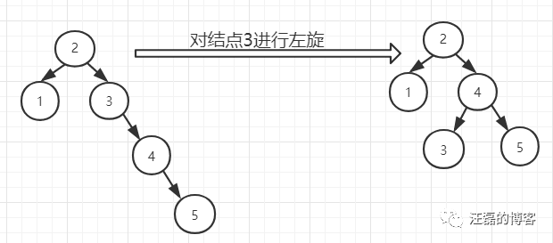
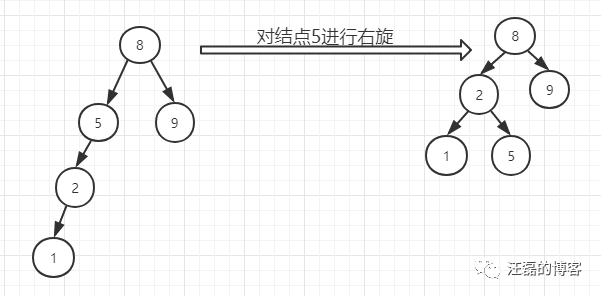
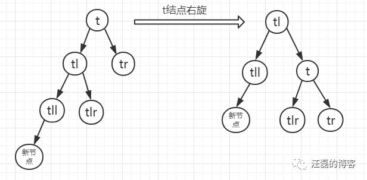
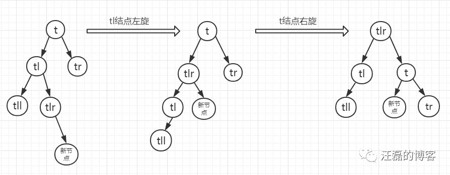
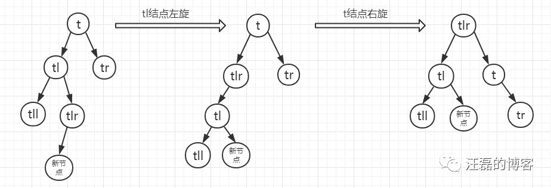
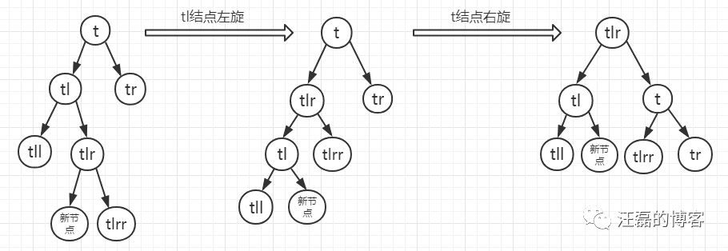
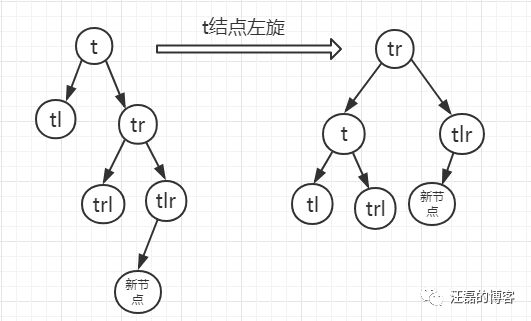

## 二叉树

### 定义

二叉搜索树是一种二叉树的树形数据结构，其定义如下：

1. 空树是二叉搜索树。
2. 若二叉搜索树的左子树不为空，则其左子树上所有点的附加权值均小于其根节点的值。
3. 若二叉搜索树的右子树不为空，则其右子树上所有点的附加权值均大于其根节点的值。
4. 二叉搜索树的左右子树均为二叉搜索树。


二叉搜索树上的基本操作所花费的时间与这棵树的高度成正比。对于一个有 n 个结点的二叉搜索树中，这些操作的最优时间复杂度为 O(\log n)，最坏为 O(n)。随机构造这样一棵二叉搜索树的期望高度为 `O(log n)`。

## AVL 树（平衡二叉查找树）

### 定义

AVL（得名于其发明者的名字（Adelson-Velskii 以及 Landis）树，是一种平衡的二叉搜索树。由于各种算法教材上对 AVL 的介绍十分冗长，造成了很多人对 AVL 树复杂、不实用的印象。但实际上，AVL 树的原理简单，实现也并不复杂。

### 性质

1. 空二叉树是一个 AVL 树
2. 如果 T 是一棵 AVL 树，那么其左右子树也是 AVL 树，并且 `|h(ls) - h(rs)| ≤ 1`，h 是其左右子树的高度
3. 树高为 `O(log n)`


平衡因子（Balance Factor）：右子树高度 - 左子树高度。

基于平衡因子，我们就可以这样定义 AVL 树：
> AVL 树： 所有结点的平衡因子的绝对值都不超过 1 的二叉树。

### 操作

对 AVL 树的修改操作一般有两种情况：插入、删除，在此过程中需要对树进行平衡化操作。

#### 树的平衡化操作——旋转

在每一次插入数值之后，树的平衡性都可能被破坏，这时可以通过一个简单的操作来矫正平衡–旋转。

旋转的目的就是减少高度，通过降低整棵树的高度来平衡。哪边的树高，就把那边的树向上旋转。

通过旋转可以降低高度。

- 所谓的左旋和右旋都是以子树为原点的：如b是a的子树，那么旋转就围绕b来进行。
- 如果b是a的左子树，那么就围绕b将a向右旋转，看着就像是a直接掉下来了，掉成了b的右子树。
- 如果b是a的右子树，那么就围绕b将a向左旋转，看着就像是a直接掉下来了，掉成了b的左子树。


插入节点时分四种情况，四种情况对应的旋转方法是不同的：

例如对于被破坏平衡的节点 a 来说：

|插入方式   | 描述  | 旋转方式  |
| -------- | ------------------------- | ------------------------- |
|LL|	在a的左子树根节点的左子树上插入节点而破坏平衡|	右旋转|
|RR|	在a的右子树根节点的右子树上插入节点而破坏平衡|	左旋转|
|LR|	在a的左子树根节点的右子树上插入节点而破坏平衡|	先左旋后右旋|
|RL|	在a的右子树根节点的左子树上插入节点而破坏平衡|	先右旋后左旋|


#### 左旋——RR

**左旋操作**

 

上图就是一个标准的X结点的左旋流程。 
在第一步图示仅仅将X结点进行左旋，成为Y结点的一个子节点。

但是此时出现一个问题，就是Y结点有了三个子节点，这连最基础的二叉树都不是了，所以需要进行第二部操作。

在第二部操作的时候，我们将B结点设置为X结点的右孩子，这里可以仔细想一下，B结点一开始为X结点的右子树Y的左孩子，那么其肯定比X结点大，比Y结点小，所以这里设置为X结点的右孩子是没有问题的。

**上图中Y结点有左子树B，如果没有左子树B，那么第二部也就不需要操作了，这里很容易理解，都没有还操作什么鬼。**

到这里一个标准的左旋流程就完成了。

左旋操作具体应用

在构建AVL树的过程中我们到底怎么使用左旋操作呢？这里我们先举一个例子，如下图： 

 

在上图中我们插入结点5的时候就出现不平衡了，3结点的平衡因子为-2，这时候我们可以将结点3进行左旋，如右图，这样就重新达到平衡状态了。

::: info 左旋代码实现

```C
private void left_rotate(AVL<E>.Node<E> t) {
    if (t != null) {
        Node tr = t.right;
        //将t结点的右孩子的左结点设置为t结点的右孩子
        t.right = tr.left;
        if (tr.left != null) {
            //重置其父节点
            tr.left.parent = t;
        }
        //t结点旋转下来，其右孩子相当于替换t结点的位置
        //所以这里同样需要调整其右孩子的父节点为t结点的父节点
        tr.parent = t.parent;
        //整棵树只有根结点没有父节点，这里检测我们旋转的是否为根结点
        //如果是则需要重置root结点
        if (t.parent == null) {
            root = tr;
        } else {
            //如果t结点位于其父节点的左子树，则旋转上去的右结点则
            //位于父节点的左子树，反之一样
            if (t.parent.left == t) {
                t.parent.left = tr;
            } else if (t.parent.right == t) {
                t.parent.right = tr;
            }
        }
        //将t结点设置为其右子树的左结点
        tr.left = t;
        //重置t结点的父节点
        t.parent = tr;
    }
}
```
:::


#### 右旋——LL

**右旋操作**

 

上图就是对Y结点进行右旋操作的流程，有了左旋操作的基础这里应该很好理解了。

第一步同样仅仅将Y结点右旋，成为X的一个结点，同样这里会出现问题X有了三个结点。

第二步，如果一开始Y左子树存在右结点，上图中也就是B结点，则将其设置为Y的右孩子。

到这里一个标准的右旋流程就完成了。

**右旋操作具体应用**

我们看一个右旋的例子，如图：

 

 在我们插入结点1的时候就会出现不平衡现象，结点5的平衡因子变为2，这里我们将结点5进行右旋，变为右图就又变为一颗AVL树了。

::: info 右旋代码实现
```C
private void right_rotate(AVL<E>.Node<E> t) {
    if (t != null) {
        Node<E> tl = t.left;
        t.left =tl.right;
        if (tl.right != null) {
            tl.right.parent = t;
        }

        tl.parent = t.parent;
        if (t.parent == null) {
            root = tl;
        } else {
            if (t.parent.left == t) {
                t.parent.left = tl;
            } else if (t.parent.right == t) {
                t.parent.right = tl;
            }
        }
        tl.right = t;
        t.parent = tl;
    }
}
```
:::


#### 左平衡操作与右平衡操作

上面我们了解了左旋与右旋的概念，也通过具体案例明白到底怎么通过左旋或者右旋来使二叉排序树重新达到AVL树的要求，但是这里要明白有些情况并不是仅仅靠一次左旋或者右旋就能实现平衡的目的，这是就需要左旋右旋一起使用来使其达到平衡的目的。

那么到底怎么区分是使用左旋或者右旋或者左旋右旋一起使用才能使树重新达到平衡呢？

这里我们就需要仔细分情况来处理了，我们在构建AVL树插入某一个元素候如果出现不平衡现象肯定是左子树或者右子树出现了不平衡现象，这里有点绕，不过也很好理解，某一结点平衡因子绝对值超过1了，肯定是左子树过高或者右子树过高产生的，这里，我们采用分治的思想来解决，分治思想是算法思想的一种，就是把一个复杂的问题分成两个或更多的相同或相似的子问题，直到最后子问题可以简单的直接求解，原问题的解即子问题的解的合并。

这里我们怎么使用分治的思想呢？首先出现不平衡只有两种可能，某一结左子树或者右子树过高导致的，我们可以先考虑左子树过高该怎么处理，然后考虑右子树过高怎么处理，当然这里只是粗略的分为两大解决问题的方向，往下还会继续分析不同情况，接下来我们将会仔细分析。


#### 左平衡操作

左平衡操作，即结点t的不平衡是因为左子树过深造成的，这时我们需要对t左子树分情况进行解决。

左平衡操作情况分类

1、如果新的结点插入后t的左孩子的平衡因子为1，也就是插入到t左孩子的左侧，则直接对结点t进行右旋操作即可



2、如果新的结点插入后t的左孩子的平衡因子为-1，也就是插入到t左孩子的右侧,则需要进行分情况讨论

+   情况a：当t的左孩子的右子树根节点的平衡因子为-1，这时需要进行两步操作，先以tl进行左旋，在以t进行右旋。
    


经过上述过程，最终又达到了平衡状态。

+   情况b：当p的左孩子的右子树根节点的平衡因子为1，这时需要进行两步操作，先以tl进行左旋，在以t进行右旋。
    


+   情况c：当p的左孩子的右子树根节点的平衡因子为0，这时需要进行两步操作，先以tl进行左旋，在以t进行右旋。
    


到这里细心的同学肯定有一个疑问，情况a,b,c不都是先以tl左旋，再以t右旋吗？为什么还要拆分出来？

首先观察a,b,c三种情况，旋转之前是叶子结点的，在两次旋转之后依然是叶子结点，也就是说其平衡因子旋转前后无变化，均是0。

但是再观察一下t,tl,tlr这三个节点旋转前后的平衡因子，不同情况下前后是不一样的，所以这里需要区分一下，具体旋转后t,tl,tlr的平衡因子如下：

- 情况a:   
t.balance = 0;   
tlr.balance = 0;   
tl.balance = 1;

- 情况b:   
t.balance = -1;   
tl.balance =0;   
tlr.balance = 0;

- 情况c:   
t.balance = 0;   
tl.balance = 0;   
tlr.balance = 0;

以上就是左平衡操作的所有情况。

::: info 左平衡具体代码
```C
private void leftBalance(AVL<E>.Node<E> t) {
    Node<E> tl = t.left;
    switch (tl.balance) {
        case LH:
            right_rotate(t);
            tl.balance = EH;
            t.balance = EH;
            break;
        case RH:
            Node<E> tlr = tl.right;
            switch (tlr.balance) {
                case RH:
                    t.balance = EH;
                    tlr.balance = EH;
                    tl.balance = LH;
                    break;
                case LH:
                    t.balance = RH;
                    tl.balance =EH;
                    tlr.balance = EH;
                    break;
                case EH:
                    t.balance = EH;
                    tl.balance = EH;
                    tlr.balance =EH;
                    break;
                //统一旋转
                default:
                    break;
            }
            //统一先以tl左旋，在以t右旋
            left_rotate(t.left);
            right_rotate(t);
            break;
        default:
            break;
    }
}
```
:::

好了，左平衡操作所有情况讲解以及具体代码实现，主要就是分治思想，加以细分然后逐个情况逐个解决的套路。

#### 右平衡操作

右平衡操作，即结点t的不平衡是因为右子树过深造成的，这时我们需要对t右子树分情况进行解决。

右平衡操作情况分类

1. 如果新的结点插入后t的右孩子的平衡因子为1，也就是插入到t左孩子的右侧，则直接对结点t进行左旋操作即可



2. 如果新的结点插入后t的右孩子的平衡因子为-1，也就是插入到t右孩子的左侧,则需要进行分情况讨论

+   情况a：当t的右孩子的左子树根节点的平衡因子为1，这时需要进行两步操作，先以tr进行右旋，在以t进行左旋。
    


+   情况b：当p的右孩子的左子树根节点的平衡因子为-1，这时需要进行两步操作，先以tr进行右旋，在以t进行左旋。
    


+   情况c：当p的右孩子的左子树根节点的平衡因子为0，这时需要进行两步操作，先以tr进行右旋，在以t进行左旋。
    


同样，a,b,c三种情况旋转前后叶子结点依然是叶子结点，变化的  
只是t,tr,trl结点的平衡因子，并且三种情况trl最后平衡因子均为0.

::: info 右平衡代码实现

```C
private void rightBalance(AVL<E>.Node<E> t) {
    Node<E> tr = t.right;
    switch (tr.balance) {
        case RH:
            left_rotate(t);
            t.balance = EH;
            tr.balance = EH;
            break;
        case LH:
            Node<E> trl = tr.left;
            switch (trl.balance) {
                case LH:
                    t.balance = EH;
                    tr.balance = RH;
                    break;
                case RH:
                    t.balance = LH;
                    tr.balance = EH;
                    break;
                case EH:
                    t.balance = EH;
                    tr.balance = EH;
                    break;

            }
            trl.balance = EH;
            right_rotate(t.right);
            left_rotate(t);
            break;
        default:
            break;
    }
}
```
:::

到此，左平衡与右平衡操作也就讲解完了，主要思想是采用的分治思想，大问题化为小问题，然后逐个解决，到这里，如果能全部理解，那么AVL树的最核心部分就完全理解了，对于红黑树来说上面也是很核心的部分。

### AVL树的创建过程

这部分我们主要了解下怎么创建AVL树，也就是添加元素方法的整体逻辑。

::: info 结点类

先看下每个结点类所包含的信息

```C
public class Node<E extends Comparable<E>>{
       E element; // data
       int balance = 0; // 每个结点的平衡因子
       Node<E> left;
       Node<E> right;
       Node<E> parent;
       public Node(E element, Node<E> parent) {
           this.element = element;
           this.parent = parent;
       }

       @Override
       public String toString() {
           // TODO Auto-generated method stub
           return element + "BF: " + balance;
       }

       public E getElement() {
           return element;
       }

       public void setElement(E element) {
           this.element = element;
       }

       public int getBalance() {
           return balance;
       }

       public void setBalance(int balance) {
           this.balance = balance;
       }

       public Node<E> getLeft() {
           return left;
       }

       public void setLeft(Node<E> left) {
           this.left = left;
       }

       public Node<E> getRight() {
           return right;
       }

       public void setRight(Node<E> right) {
           this.right = right;
       }

       public Node<E> getParent() {
           return parent;
       }

       public void setParent(Node<E> parent) {
           this.parent = parent;
       }
   }
```
:::

最主要的是每个结点类添加了一个balance属性，也就是记录自己的平衡因子，在插入元素的时候需要动态的调整。

我们看下插入元素方法的Java实现：

::: info 插入元素方法 Java 实现

```Java
public boolean addElement(E element) {
    Node<E> t = root;
    //t检查root是否为空，如果为空则表示AVL树还没有创建，
    //则需要创建根结点即可
    if (t == null) {
        root = new Node<E>(element, null);
        size = 1;
        root.balance = 0;
        return true;
    } else {
        int cmp = 0;
        Node<E> parent;
        Comparable<? super E> e = (Comparable<? super E>)element;
        //查找父类的过程，逻辑和讲解二叉排序树时查找父类是一样的
        do {
            parent = t;
            cmp = e.compareTo(t.element);
            if (cmp < 0) {
                t= t.left;
            } else if (cmp > 0) {
                t= t.right;
            } else {
                return false;
            }
        } while (t != null);
        //创建结点，并挂载到父节点上
        Node<E> child = new Node<E>(element, parent);
        if (cmp < 0) {
            parent.left = child;
        } else {
            parent.right = child;
        }
        //节点已经插入，
        // 插入元素后 检查平衡性，回溯查找
        while (parent != null) {
            cmp = e.compareTo(parent.element);
            //元素在左边插入
            if (cmp < 0) {
                parent.balance++;
            } else{ //元素在右边插入
                parent.balance --;
            }
            //插入之后父节点balance正好完全平衡，则不会出现平衡问题
            if (parent.balance == 0) {
                break;
            }
            //查找最小不平衡二叉树
            if (Math.abs(parent.balance) == 2) {
                //出现平衡问题
                fix(parent);
                break;
            } else {
                parent = parent.parent;
            }
        }
        size++;
        return true;
    }
}
```
:::

其大体流程主要分为两大部分，前半部分和二叉排序树插入元素的逻辑一样，主要是查找父节点，将其挂载到父节点上，而后半部分就是AVL树特有的了，也就是查找最小不平衡二叉树然后对其修复，修复也就是通过左旋右旋操作使其达到平衡状态，我们看下fix方法主要逻辑：

::: info 
```C
private void fix(AVL<E>.Node<E> parent) {
    if (parent.balance == 2) {
        leftBalance(parent);
    }
    if (parent.balance == -2) {
        rightBalance(parent);
    }
}
```
:::

很简单，就是判断左边与右边哪边不平衡，进而进行左平衡或者右平衡操作，至于左平衡右平衡上面已经详细讲解过，不在过多说明。

好了，以上就是构建一颗AVL树的过程讲解，如果有不懂得地方可以静下心来自己好好分析一下。

### AVL树总结

本篇主要讲解了AVL的概念以及通过最基础的左旋，右旋使其保持树中每一个结点的平衡因子值保证在「-1，0，1」中，这样构建出来的树具有很好的查找特性。

AVL树相对于红黑树来说是一颗严格的平衡二叉树，平衡条件非常严格（树高差只有1），只要插入或删除不满足上面的条件就要通过旋转来保持平衡。由于旋转是非常耗费时间的。AVL树适合用于插入删除次数比较少，但查找多的情况。

在平衡二叉树中应用比较多的是红黑树，红黑树对高度差要求没有AVL那么严格，用以保持平衡的左旋右旋操作次数比较少，用于搜索时，插入删除次数多的情况下通常用红黑树来取代AVL树。TreeMap的实现以及JDK1.8以后的HashMap中都有红黑树的具体应用。
