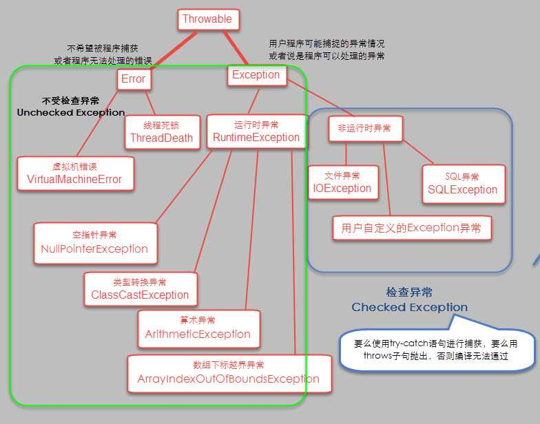

### Java异常包含三种类型的异常：

- `检查性异常：`（非运行时异常）最具代表的检查性异常是用户错误或问题引起的异常，这是程序员无法预见的。例如要打开一个不存在文件时，一个异常就发生了，这些异常在编译时不能被简单地忽略。原则上如果不处理，程序就不能编译通过。
- `运行时异常：` 运行时异常是可能被程序员避免的异常。与检查性异常相反，运行时异常可以在编译时被忽略。
- `错误：` 错误不是异常，而是脱离程序员控制的问题。错误在代码中通常被忽略。例如，当栈溢出时，一个错误就发生了，它们在编译也检查不到的。

### **Java 中的异常都继承自 Throwable。**

继承自 Throwable 的有两个主要的子类，`Error` 和 `Exception`，这两个子类除了实现父类 Throwable 的构造方法之外，没有额外实现其他的方法，WHY？

看 Exception 和 Error 的注释

- Exception

    The class Exception and its subclasses are a form of Throwable that indicates conditions that a reasonable application might want to catch.
    The class Exception and any subclasses that are not also subclasses of RuntimeException are checked exceptions. Checked exceptions need to be declared in a method or constructor's throws clause if they can be thrown by the execution of the method or constructor and propagate outside the method or constructor boundary.
    
- Error
    
    An Error is a subclass of Throwable that indicates serious problems that a reasonable application should not try to catch. Most such errors are abnormal conditions. The ThreadDeath error, though a "normal" condition, is also a subclass of Error because most applications should not try to catch it.
    A method is not required to declare in its throws clause any subclasses of Error that might be thrown during the execution of the method but not caught, since these errors are abnormal conditions that should never occur. That is, Error and its subclasses are regarded as unchecked exceptions for the purposes of compile-time checking of exceptions.
    

简单来说，Exception 是程序运行中可以预料的、应该 try catch 的错误；而 Error 是程序运行中不应该 try catch 的错误，因为这种错误是不应该出现的，绝大部分的 Error 都会导致程序（比如 JVM 自身）处于非正常的、不可恢复状态。比如网络请求失败返回的错误应该被捕获，以进行其他逻辑处理；而线程死锁（ThreadDeath）的错误不应该被捕获，类似的还有`OutOfMemoryError`、`StackOverflowError`

### 深究 Error 和 Exception 和

- Error 由 JVM生成并抛出，大多数错误**与代码编写者所执行的操作无关**。例如，Java虚拟机运行错误（Virtual MachineError），当JVM不再有继续执行操作所需的内存资源时，将出现OutOfMemoryError。这些异常发生时，Java虚拟机（JVM）一般会选择线程终止；还有发生在虚拟机试图执行应用时，如类定义错误（NoClassDefFoundError）、链接错误（LinkageError）。这些错误是不可查的，因为它们在应用程序的控制和处理能力之外，而且绝大多数是程序运行时不允许出现的状况。对于设计合理的应用程序来说，即使确实发生了错误，本质上也不应该试图去处理它所引起的异常状况。在Java中，错误通常是使用Error的子类描述。
- Exception 又分为**`不检查（unchecked）异常**（运行时异常）`和**`可检查（checked）异常（非运行时异常）`。**
    - 在 Exception 分支中有一个重要的子类 RuntimeException（运行时异常），该类型的异常自动为你所编写的程序定义 ArrayIndexOutOfBoundsException（数组下标越界）、NullPointerException（空指针异常）、ArithmeticException（算术异常）、MissingResourceException（丢失资源）、ClassNotFoundException（找不到类）等异常，这些异常是**不检查异常**，程序中可以选择捕获处理，也可以不处理。这些异常一般是由程序逻辑错误引起的，程序应该从逻辑角度尽可能避免这类异常的发生；
    - 而RuntimeException之外的异常我们统称为**非运行时异常**，这是编译期检查的一部分，从程序语法角度讲是必须进行处理的异常，**如果不处理，程序就不能编译通过**。如IOException、SQLException等以及用户自定义的Exception异常，一般情况下不自定义检查异常。

’