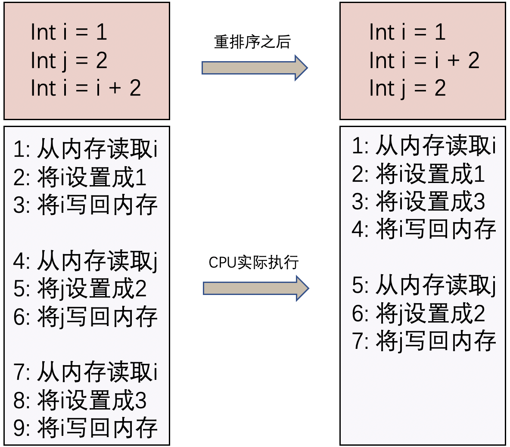
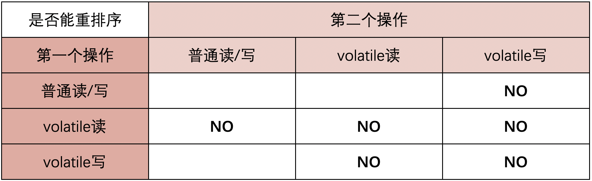
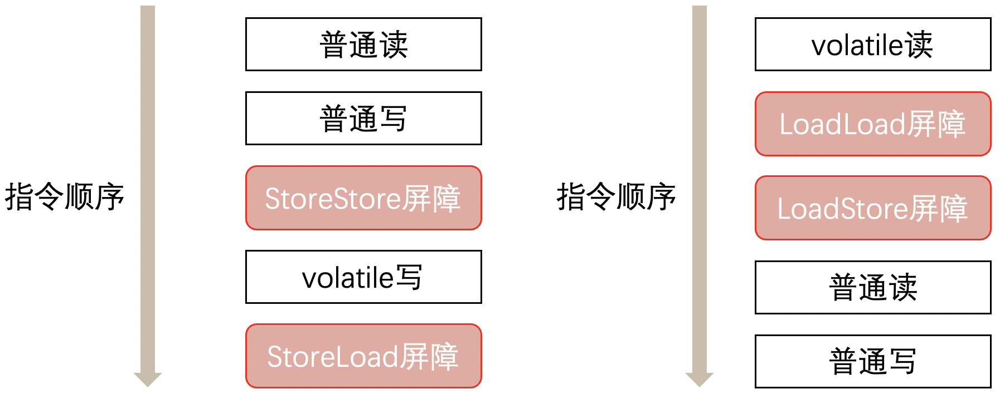
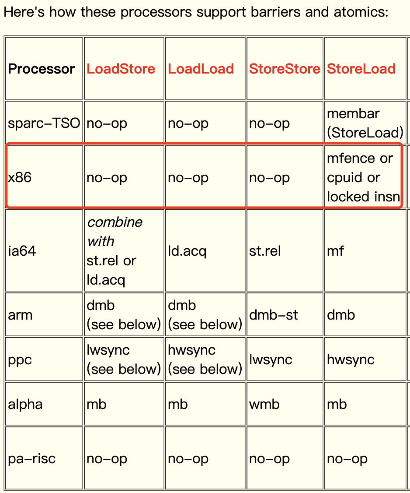
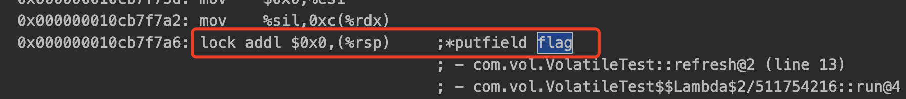

复习一下并发三要素
- 原子性
- 有序性
- 可见性

`volatile` 关键字解决了并发中的上述三个问题

## 一、防止重排序

### 什么是重排序

重排序是指编译器和处理器为了优化程序性能而对指令序列进行重新排序的一种手段。

### 为什么要重排序

简单来说，就是为了提升执行效率。为什么能提升执行效率呢？我们看下面这个例子：



可以看到重排序之后CPU实际执行省略了一个读取和写回的操作，也就间接的提升了执行效率。
上图的例子只是为了让读者更好的理解为什么重排序能提升执行效率，实际上Java里面的重排序并不是基于代码级别的，从代码到CPU执行之间还有很多个阶段，CPU底层还有一些优化，实际上的执行流程可能并不是上图的说的那样。

### 三种重排序

在执行程序时为了提高性能，编译器和处理器常常会对指令做重排序。重排序分三种类型：
1. `编译器优化的重排序` 编译器在不改变单线程程序语义的前提下，可以重新安排语句的执行顺序。
2. `指令级并行的重排序` 现代处理器采用了指令级并行技术（Instruction-Level Parallelism， ILP）来将多条指令重叠执行。如果不存在数据依赖性，处理器可以改变语句对应机器指令的执行顺序。
3. `内存系统的重排序` 由于处理器使用缓存和读 / 写缓冲区，这使得加载和存储操作看上去可能是在乱序执行。

从 java 源代码到最终实际执行的指令序列，会分别经历下面三种重排序：


上述的 1 属于`编译器重排序`，2 和 3 属于`处理器重排序`。
这些重排序都可能会导致多线程程序出现内存可见性问题。
- 对于编译器，JMM 的编译器重排序规则会禁止特定类型的编译器重排序（不是所有的编译器重排序都要禁止）。
- 对于处理器重排序，JMM 的处理器重排序规则会要求 java 编译器在生成指令序列时，插入特定类型的内存屏障（memory barriers，intel 称之为 memory fence）指令，通过内存屏障指令来禁止特定类型的处理器重排序（不是所有的处理器重排序都要禁止）。

重排序可以提高程序的运行效率，但是必须遵循 `as-if-serial` 语义。

::: tip as-if-serial 语义
指不管怎么重排序（编译器和处理器为了提高并行度），（单线程）程序的执行结果不能被改变。

编译器，runtime 和处理器都必须遵守 as-if-serial 语义。

为了遵守 as-if-serial 语义，编译器和处理器不会对存在数据依赖关系的操作做重排序，因为这种重排序会改变执行结果。但是，如果操作之间不存在数据依赖关系，这些操作可能被编译器和处理器重排序。
:::


### 双检锁单例模式要加 volatile 关键字

```java
public class Singleton {

    public static volatile Singleton singleton;

    private Singleton() {};

    public static Singleton getInstance() {
        if (singleton == null) {
            synchronized (singleton.class) {
                if (singleton == null) {
                    singleton = new Singleton();
                }
            }
        }
        return singleton;
    }
}
```

要理解这个问题，先要了解对象的构造过程，实例化一个对象其实可以分为三个步骤：
1. 分配内存空间。
2. 初始化对象。
3. 将内存空间的地址赋值给对应的引用。

但是由于操作系统可以对指令进行重排序，所以上面的过程也可能会变成如下过程：
1. 分配内存空间。
2. 将内存空间的地址赋值给对应的引用。
3. 初始化对象.

如果是这个流程，在 singleton 指向分配的内存空间之后，singleton 就不为空了。但是在没有调用构造器初始化实例之前，这个对象还处于半初始化状态，在这个状态下，实例的属性都还是默认属性，这个时候如果有另一个线程调用 getInstance() 方法时，会拿到这个半初始化的对象，导致出错。因此，为了防止这个过程的重排序，我们需要将变量设置为 volatile 类型的变量。

### 原理

#### 重排序规则

为了实现 volatile 的内存语义，JMM会限制特定类型的编译器和处理器重排序，JMM 会针对编译器制定 volatile 重排序规则表：



总结来说就是：
- 第二个操作是 volatile 写，不管第一个操作是什么都不会重排序
- 第一个操作是 volatile 读，不管第二个操作是什么都不会重排序
- 第一个操作是 volatile 写，第二个操作是 volatile 读，也不会发生重排序

#### 内存屏障

##### JMM 层面

如何保证这些操作不会发送重排序呢？就是通过插入`内存屏障`保证的，JMM层面的内存屏障分为读（load）屏障和写（Store）屏障，排列组合就有了四种屏障。对于 volatile 操作，JMM 内存屏障插入策略：
- 在每个 volatile 写操作的前面插入一个 StoreStore 屏障
- 在每个 volatile 写操作的后面插入一个 StoreLoad 屏障
- 在每个 volatile 读操作的后面插入一个 LoadLoad 屏障
- 在每个 volatile 读操作的后面插入一个 LoadStore 屏障





**上面的屏障都是JMM规范级别的**，意思是，按照这个规范写 JDK 能保证 volatile 修饰的内存区域的操作不会发送重排序。

##### 硬件层面

在硬件层面上，也提供了一系列的内存屏障来提供一致性的能力。拿 X86 平台来说，主要提供了这几种内存屏障指令：
- `lfence 指令`：在 lfence 指令前的读操作当必须在 lfence 指令后的读操作前完成，类似于读屏障
- `sfence 指令`：在 sfence 指令前的写操作当必须在 sfence 指令后的写操作前完成，类似于写屏障
- `mfence 指令`： 在 mfence 指令前的读写操作当必须在 mfence 指令后的读写操作前完成，类似读写屏障。

JMM规范需要加这么多内存屏障，但实际情况并不需要加这么多内存屏障。以我们常见的X86处理器为例，X86处理器不会对读-读、读-写和写-写操作做重排序，会省略掉这3种操作类型对应的内存屏障，仅会对写-读操作做重排序。所以 volatile 写-读操作只需要在 volatile 写后插入 StoreLoad 屏障。在《The JSR-133 Cookbook for Compiler Writers》中，也很明确的指出了这一点：



而在x86处理器中，有三种方法可以实现实现 StoreLoad 屏障的效果，分别为：

- mfence 指令：上文提到过，能实现全能型屏障，具备 lfence 和 sfence 的能力。
- cpuid 指令：cpuid 操作码是一个面向 x86 架构的处理器补充指令，它的名称派生自 CPU 识别，作用是允许软件发现处理器的详细信息。
- lock 指令前缀：总线锁。lock 前缀只能加在一些特殊的指令前面。

#### lock 指令前缀

::: tip lock 应用
实际上 HotSpot 关于 volatile 的实现就是使用的 lock 指令，只在 volatile 标记的地方加上带 lock 前缀指令操作，并没有参照 JMM 规范的屏障设计而使用对应的 mfence 指令。
:::

加上`-XX:+UnlockDiagnosticVMOptions -XX:+PrintAssembly -Xcomp`JVM参数再次执行main方法，在打印的汇编码中，我们也可以看到有一个`lock addl $0x0,(%rsp)`的操作。



`lock addl $0x0,(%rsp)` 后面的 `addl $0x0,(%rsp)` 其实是一个空操作。add是加的意思，0x0 是 16 进制的 0，rsp 是一种类型寄存器，合起来就是把寄存器的值加 0，加 0 是不是等于什么都没有做？这段汇编码仅仅是 lock 指令的一个载体而已。其实上文也有提到过，lock 前缀只能加在一些特殊的指令前面，add 就是其中一个指令。

lock 的几个作用：

- 确保后续指令执行的原子性。在 Pentium 及之前的处理器中，带有 lock 前缀的指令在执行期间会锁住总线，使得其它处理器暂时无法通过总线访问内存，很显然，这个开销很大。在新的处理器中，Intel使用缓存锁定来保证指令执行的原子性，缓存锁定将大大降低 lock 前缀指令的执行开销。
- 禁止该指令与前面和后面的读写指令重排序。
- 把写缓冲区的所有数据刷新到内存中。

::: tip 原理总结
由此可见，lock 指令既保证了`可见性`也保证了`原子性`。
:::

::: warning
重要的事情再说一遍，是 lock 指令既保证了`可见性`也保证了`原子性`，和什么缓冲一致性协议啊，MESI 什么的没有一点关系。
:::

## 二、实现可见性

可见性问题主要指一个线程修改了共享变量值，而另一个线程却看不到。引起可见性问题的主要原因是每个线程拥有自己的一个高速缓存区——线程工作内存。volatile 关键字能有效的解决这个问题，我们看下下面的例子，就可以知道其作用：

```java
public class TestVolatile {
    private static boolean stop = false;

    public static void main(String[] args) {
        // Thread-A
        new Thread("Thread A") {
            @Override
            public void run() {
                while (!stop) {
                }
                System.out.println(Thread.currentThread() + " stopped");
            }
        }.start();

        // Thread-main
        try {
            TimeUnit.SECONDS.sleep(1);
            System.out.println(Thread.currentThread() + " after 1 seconds");
        } catch (InterruptedException e) {
            e.printStackTrace();
        }
        stop = true;
    }
}
```

执行输出如下

```sh
Thread[main,5,main] after 1 seconds

// Thread A一直在loop, 因为Thread A 由于可见性原因看不到Thread Main 已经修改stop的值
```

可以看到 Thread-main 休眠1秒之后，设置 stop = ture，但是Thread A根本没停下来，这就是可见性问题。如果通过在stop变量前面加上volatile关键字则会真正stop:

```sh
Thread[main,5,main] after 1 seconds
Thread[Thread A,5,main] stopped

Process finished with exit code 0
```

## 三、保证原子性

::: info 单次读/写
volatile不能保证完全的原子性，只能保证单次的读/写操作具有原子性。
:::

从如下两个问题来理解

###  i++ 为什么不能保证原子性?

对于原子性，需要强调一点，也是大家容易误解的一点：对 volatile 变量的单次读/写操作可以保证原子性的，如 long 和 double 类型变量，但是并不能保证 i++ 这种操作的原子性，因为本质上 i++ 是读、写两次操作。

现在我们就通过下列程序来演示一下这个问题：

```java
public class VolatileTest01 {
    volatile int i;

    public void addI(){
        i++;
    }

    public static void main(String[] args) throws InterruptedException {
        final  VolatileTest01 test01 = new VolatileTest01();
        for (int n = 0; n < 1000; n++) {
            new Thread(new Runnable() {
                @Override
                public void run() {
                    try {
                        Thread.sleep(10);
                    } catch (InterruptedException e) {
                        e.printStackTrace();
                    }
                    test01.addI();
                }
            }).start();
        }
        Thread.sleep(10000);//等待10秒，保证上面程序执行完成
        System.out.println(test01.i);
    }
}
```

大家可能会误认为对变量i加上关键字 volatile 后，这段程序就是线程安全的。大家可以尝试运行上面的程序。
下面是我本地运行的结果：981。
可能每个人运行的结果不相同。不过应该能看出，volatile 是无法保证原子性的(否则结果应该是1000)。原因也很简单，i++ 其实是一个复合操作，包括三步骤：
- 读取i的值。
- 对i加1。
- 将i的值写回内存。 

volatile 是无法保证这三个操作是具有原子性的，我们可以通过 AtomicInteger 或者 Synchronized 来保证 +1 操作的原子性。

**注：上面几段代码中多处执行了Thread.sleep()方法，目的是为了增加并发问题的产生几率，无其他作用。**


## 四、volatile 的应用场景

使用 volatile 必须具备的条件
- 对变量的写操作不依赖于当前值。
- 该变量没有包含在具有其他变量的不变式中。
- 只有在状态真正独立于程序内其他内容时才能使用 volatile。


::: tabs

@tab:active 状态标志

### 状态标志

也许实现 volatile 变量的规范使用仅仅是使用一个布尔状态标志，用于指示发生了一个重要的一次性事件，例如完成初始化或请求停机。

```java
volatile boolean shutdownRequested;
......
public void shutdown() { 
    shutdownRequested = true; 
}

public void doWork() { 
    while (!shutdownRequested) { 
        // do stuff
    }
}
```

@tab:active 一次性安全发布

### 一次性安全发布(one-time safe publication)

缺乏同步会导致无法实现可见性，这使得确定何时写入对象引用而不是原始值变得更加困难。
在缺乏同步的情况下，可能会遇到某个对象引用的更新值(由另一个线程写入)和该对象状态的旧值同时存在。(这就是造成著名的双重检查锁定(double-checked-locking)问题的根源，其中对象引用在没有同步的情况下进行读操作，产生的问题是您可能会看到一个更新的引用，但是仍然会通过该引用看到不完全构造的对象)。

```java
public class BackgroundFloobleLoader {

    public volatile Flooble theFlooble;
 
    public void initInBackground() {
        // do lots of stuff
        theFlooble = new Flooble();  // this is the only write to theFlooble
    }
}
 
public class SomeOtherClass {

    public void doWork() {
        while (true) { 
            // do some stuff...
            // use the Flooble, but only if it is ready
            if (floobleLoader.theFlooble != null) 
                doSomething(floobleLoader.theFlooble);
        }
    }
}
```

@tab:active 独立观察

### 独立观察(independent observation)

安全使用 volatile 的另一种简单模式是定期 发布 观察结果供程序内部使用。
例如，假设有一种环境传感器能够感觉环境温度。一个后台线程可能会每隔几秒读取一次该传感器，并更新包含当前文档的 volatile 变量。然后，其他线程可以读取这个变量，从而随时能够看到最新的温度值。

```java
public class UserManager {

    public volatile String lastUser;
 
    public boolean authenticate(String user, String password) {
        boolean valid = passwordIsValid(user, password);
        if (valid) {
            User u = new User();
            activeUsers.add(u);
            lastUser = user;
        }
        return valid;
    }
}
```

@tab:active volatile bean 模式

### volatile bean 模式

在 volatile bean 模式中，JavaBean 的所有数据成员都是 volatile 类型的，并且 getter 和 setter 方法必须非常普通 —— 除了获取或设置相应的属性外，不能包含任何逻辑。此外，对于对象引用的数据成员，引用的对象必须是有效不可变的。(这将禁止具有数组值的属性，因为当数组引用被声明为 volatile 时，只有引用而不是数组本身具有 volatile 语义)。对于任何 volatile 变量，不变式或约束都不能包含 JavaBean 属性。

```java
@ThreadSafe
public class Person {
    private volatile String firstName;
    private volatile String lastName;
    private volatile int age;
 
    public String getFirstName() { return firstName; }
    public String getLastName() { return lastName; }
    public int getAge() { return age; }
 
    public void setFirstName(String firstName) { 
        this.firstName = firstName;
    }
 
    public void setLastName(String lastName) { 
        this.lastName = lastName;
    }
 
    public void setAge(int age) { 
        this.age = age;
    }
}
```


@tab:active 开销较低的读－写锁策略

### 开销较低的读－写锁策略

volatile 的功能还不足以实现计数器。因为 ++x 实际上是三种操作(读、添加、存储)的简单组合，如果多个线程凑巧试图同时对 volatile 计数器执行增量操作，那么它的更新值有可能会丢失。 
如果读操作远远超过写操作，可以结合使用内部锁和 volatile 变量来减少公共代码路径的开销。 
安全的计数器使用 synchronized 确保增量操作是原子的，并使用 volatile 保证当前结果的可见性。如果更新不频繁的话，该方法可实现更好的性能，因为读路径的开销仅仅涉及 volatile 读操作，这通常要优于一个无竞争的锁获取的开销。

```java
@ThreadSafe
public class CheesyCounter {
    // Employs the cheap read-write lock trick
    // All mutative operations MUST be done with the 'this' lock held
    @GuardedBy("this") private volatile int value;
 
    public int getValue() { return value; }
 
    public synchronized int increment() {
        return value++;
    }
}
```

@tab:active 双重检查

### 双重检查(double-checked)

就是我们上文举的例子。单例模式的一种实现方式，但很多人会忽略 volatile 关键字，因为没有该关键字，程序也可以很好的运行，只不过代码的稳定性总不是 100%，说不定在未来的某个时刻，隐藏的 bug 就出来了。

```java
class Singleton {

    private volatile static Singleton instance;
    
    private Singleton() { }
    
    public static Singleton getInstance() {
        if (instance == null) {
            syschronized(Singleton.class) {
                if (instance == null) {
                    instance = new Singleton();
                }
            }
        }
        return instance;
    } 
}
```

:::

## 五、参考 

- [关键字:volatile详解](https://pdai.tech/md/java/thread/java-thread-x-key-volatile.html)
- [深入汇编指令理解Java关键字volatile](https://heapdump.cn/article/2379243)

