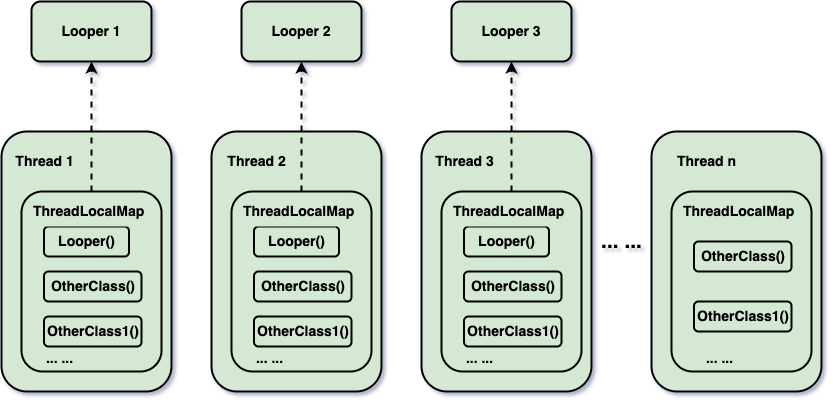

> 很多（我就直接代表很多人了🐶）做 Android 的同学认识和学习 ThreadLocal 都是通过 Looper 中的 sThreadLocal 这个静态变量开始的，然后就会进入一个误区：sThreadLocal 是 Looper 中的一个静态变量啊，当 `Looper#prepare(boolean quitAllowed)` 方法调用  `sThreadLocal.set(new Looper(quitAllowed))` 的时候存到 ThreadLocalMap 中的 value (Looper) 的 key 值竟然是 this，也就是 sThreadLocal 这个静态变量？那一个静态变量怎么能作为 key值呢？静态变量在这个进程中可是独一份啊，其他线程的 Looper 再调用 Looper#prepare(boolean quitAllowed) 的时候岂不会把之前的 Looper 给替代了？

这节不讲细节，讲思想，讲线程私有数据存储的思想。下面听我慢慢道来～

## ThreadLocal 是怎么存数据的？

> 我们都知道 ThreadLocal 实现了线程私有数据的存储。那么，ThreadLocal 到底是怎么存储数据的？或者说，ThreadLocal 是作为一个存储数据的数据结构存在的吗？

显然不是，真正存储数据的是 ThreadLocal 的静态内部类 ThreadLocal.ThreadLocalMap。观其名而知其意，ThreadLocalMap 是一个 map，map 是一个什么结构？当然是 key-value 形式的。也就是说，现在我们不需要了解 ThreadLocalMap 的具体实现方式，我们只需要知道他是一个 key-value 形式保存数据的一个 map 结构就够了。

## ThreadLocal 存在的意义是什么？

> 我们知道了真正保存数据的是保存在 ThreadLocalMap 里的，那 ThreadLocal 又有什么作用？

简单来说，ThreadLocal 主要是为了封装 ThreadLocalMap，对外提供 set()、get() 方法，让开发者可以方便地存取线程本地变量，而无需直接操作底层的 ThreadLocalMap。示例：

```java
ThreadLocal<String> threadLocal = new ThreadLocal<>();
threadLocal.set("Hello");  // 数据实际存储在当前线程的 ThreadLocalMap 里
String value = threadLocal.get();  // 从当前线程的 ThreadLocalMap 取出数据
```

如果没有 ThreadLocal，开发者需要手动维护 ThreadLocalMap，代码会变得复杂：

```java
Thread currentThread = Thread.currentThread();
ThreadLocalMap map = currentThread.threadLocals; // 假设可以直接访问
map.set(this, "Hello"); // this 指 ThreadLocal 实例
String value = (String) map.get(this);
```

ThreadLocal 隐藏了这些底层细节，提供更友好的 API。

## ThreadLocal/ThreadLocalMap 怎么实现线程隔离的

### 1. Thread 和 ThreadLocalMap 的关系

> 都说 ThreadLocal 能够实现线程私有数据的存储，那么他到底是怎么实现的？

首先我们要明白一点，`真正存储数据的 ThreadLocalMap 是作为 Thread 的一个成员变量存在的。`
来让我们看看 `Thread` 的源码：
```java
public class Thread implements Runnable {

    ...

    /* ThreadLocal values pertaining to this thread. This map is maintained
     * by the ThreadLocal class. */
    ThreadLocal.ThreadLocalMap threadLocals = null;
    
    ...

    /**
     * This method is called by the system to give a Thread
     * a chance to clean up before it actually exits.
     */
    private void exit() {
        if (group != null) {
            group.threadTerminated(this);
            group = null;
        }
        /* Aggressively null out all reference fields: see bug 4006245 */
        target = null;
        /* Speed the release of some of these resources */
        threadLocals = null;
        inheritableThreadLocals = null;
        inheritedAccessControlContext = null;
        blocker = null;
        uncaughtExceptionHandler = null;
    }
}
```
Thread 就是线程，那就很容易理解了，一个 Thread 都可以带一个 ThreadLocalMap 变量。而且在 `Thread#exit()` 方法中，threadLocals 也会被置空。所以说，ThreadLocalMap 存储的数据的生命周期跟 Thread 的生命周期是同步的。


### 2. 泛型在 ThreadLocal 中的应用。

```java
public class ThreadLocal<T> {
    ...
}
```

ThreadLocal 是一个泛型类，T 代表的就是 Value 的类型。

```java
static class ThreadLocalMap {
    ...
}
```

而静态内部类 ThreadLocalMap 并没有声明泛型定义。而是在 ThreadLocalMap 的静态内部类 Entry 中声明了泛型定义。

```java
static class Entry extends WeakReference<ThreadLocal<?>> {
    /** The value associated with this ThreadLocal. */
    Object value;

    Entry(ThreadLocal<?> k, Object v) {
        super(k);
        value = v;
    }
}
```

这里又会涉及到很多人的一个误区。很多人默认或者在刚开始学习 ThreadLocal 的时候误以为在一个 ThreadLocalMap 中存储的是一种类型的 value，其实不然，源代码很清晰的展示了，Entry 的成员变量 Value 的类型是 Object，也就是说，`一个 ThreadLocalMap 可以存储任何类型的 Value`。简单的说，在一个 Thread 对象的 threadLocals 成员变量里，存储的数据可能有 Integer、String、List... 任何类型的数据同时存在。

到目前为止，两个理解 ThreadLocal 非常重要的点就讲清楚了。再总结一下：

- 真正存储数据的 ThreadLocalMap 是作为 Thread 的一个成员变量存在的。
- 一个 ThreadLocalMap 可以存储任何类型的 Value`（而且，一定程度上来说，他存储的总是不同类型的数据）`。

所以现在大家大概懂什么叫`“ThreadLocal 实现了线程私有数据存储“`了吧？

### 以 Android 架构中的 Looper 为例

在 Android 的消息机制中，Handler 和 Looper 是紧密相关的。如果你不了解消息机制也没关系，简单解释就是，基本每一条线程都要对应一个 Looper。注意，注意，看我这句话：“基本每一条线程都要对应一个 Looper“，聪明的你想到什么？对！就是线程私有数据的存储！所以，我们就可以用 ThreadLocal 来存储 Looper。

在使用 Handler 之前，首先要先调用 Looper#prepare()：

```java
public static void prepare() {
    prepare(true);
}

private static void prepare(boolean quitAllowed) {
    if (sThreadLocal.get() != null) {
        throw new RuntimeException("Only one Looper may be created per thread");
    }
    sThreadLocal.set(new Looper(quitAllowed));
}
```

通过代码我们可以看出来，在 prepare 方法中，通过 `sThreadLocal.set(new Looper(quitAllowed))`。

再来看 ThreadLocal#set(T value) 方法：

```java
public void set(T value) {
    Thread t = Thread.currentThread();
    ThreadLocalMap map = getMap(t);
    if (map != null) {
        map.set(this, value);
    } else {
        createMap(t, value);
    }
}

ThreadLocalMap getMap(Thread t) {
    return t.threadLocals;
}
```

可以看到，`getMap(t)`其实就是直接取`当前线程`的成员变量 ThreadLocalMap。然后以 <ThreadLocal, Looper> 这种 <Key, Value> 键值对的形式将 Looper 的 <sThreadLocal, Looper()> 存入到`当前线程`的 ThreadLocalMap 中。这就 callback 到最开始的问题：`其他线程的 Looper 再调用 Looper#prepare(boolean quitAllowed) 的时候岂不会把之前的 Looper 给替代了？`。

::: tip 答案
`当然是不会`。

以 sThreadLocal 为 Key 的键值对存到的是当前 Thread 1 的 ThreadLocalMap 中.

而在 Android 中，Looper 和 Thread 是一一对应的（如果 Thread 有 Looper 的话，Thread 可以没有 Looper），其他线程 Thread 2 再调用 Looper#prepare(boolean quitAllowed) 方法的时候会将新一个 Looper 存到其对应 Thread 2 的 ThreadLocalMap。

不同 Thread 的 ThreadLocalMap 中可能有相同的 Key，但是对应的 Value 是不同的。也就是说，Looper 中的静态变量 sThreadLocal 是可以作为 Key 出现在不同的 Thread 的 ThreadLocalMap 中，只是对应的 Value（Looper）是不同的。
:::


