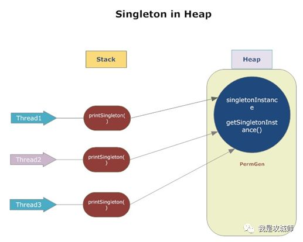

## 前言

单例模式在Java开发中是非常经典和实用的一种设计模式，在JDK的内部包的好多api都采用了单例模式，如我们熟悉的Runtime类.

单例模式总的来说有两种创建方式，一种是延迟加载的模式，一种是非延迟加载的模式，今天我们来学习一下基于双检锁延迟加载的单例模式。

## 什么是单例模式

顾名思义，单例模式指的是在整个程序运行期间，我们只能初始化某个类一次，然后一直使用这个实例，尤其是在多线程的环境下，也要保证如此。

## 基于双检锁的单例模式

在介绍基于双检锁的单例模式下，我们先思考下如何在使用延迟加载的情况下实现一个单例模式，可能有一些比较年轻的小伙伴，不假思索的就写下了下面的一段代码：

```java
private static DoubleCheckSingleton instance;

private DoubleCheckSingleton() {}

public static DoubleCheckSingleton getErrorInstance(){
    if (instance == null){
        instance = new DoubleCheckSingleton();
    }
    return instance;
}
```

上面的代码在单线程的环境下是没有问题的，但是在多线程的环境下是不能保证只创建一个实例的， 然后小伙伴想了下，这还不简单，加个同步关键字就可以了：

```java
private static DoubleCheckSingleton instance;

private DoubleCheckSingleton() {}

public synchronized static DoubleCheckSingleton getErrorInstance(){
    if (instance == null){
        instance = new DoubleCheckSingleton();
    }
    return instance;
}
```

嗯，这下看起来没问题，但唯一的不足就是，这段代码虽然可以保证只创建一个单例，但其性能不高，因为每次访问这个方法的时候都需要执行同步操作，那么有没有方法可以避免这一个缺点呢？这个时候我们就可以用双检锁的模式了：

```java
private volatile static DoubleCheckSingleton instance;

private DoubleCheckSingleton() {}

public static DoubleCheckSingleton getInstance(){
    if (instance == null){ //第一层检查
        synchronized (DoubleCheckSingleton.class){
            if (instance == null){ //第二层检查
                instance = new DoubleCheckSingleton();
            }
        }
    }
    return instance;
}
```

想要彻底理解双检锁模式的原理，首先要明白在Java里面一个线程对共享变量的修改，对于另外一个线程是不可预知的，也就是说它可能看不到变化，也有可能会看到，虽然在大多数时候是看不到的，但这不能证明它总是会被看到，除非正确的使用同步，否则是没法掌控的。

关于双检锁里面为什么必须要加volatile关键字，主要用来避免重排序问题导致其他的线程看到了一个已经分配内存和地址但没有初始化的对象，也就是说这个对象还不是处于可用状态，就被其他线程引用了。

下面的代码在多线程环境下不是原子执行的。

```java
instance = new DoubleCheckSingleton();
```

正常的底层执行顺序会转变成三步：

1. 给DoubleCheckSingleton类的实例instance分配内存
2. 调用实例instance的构造函数来初始化成员变量
3. 将instance指向分配的内存地址


上面的三步，无论在 A 线程当前执行到那一步骤，对 B 线程来说可能看到A的状态只能是两种，1、2看到的都是 null，3 看到的非 null，这是没问题的。

但是如果线程 A 在重排序的情况下，上面的执行顺序会变成 1,3,2。现在假设 A 线程按 1,3,2三个步骤顺序执行，当执行到第二步的时候。B线程开始调用这个方法，那么在第一个 null 的检查的时候，就有可能看到这个实例不是 null，然后直接返回这个实例开始使用，但其实是有问题的，因为对象还没有初始化，状态还处于不可用的状态，故而会导致异常发生。

要解决这个问题，可以通过 `volatile` 关键词来避免指令重排序，这里相比可见性问题主要是为了避免重排序问题。如果使用了 volatile 修饰成员变量，那么在变量赋值之后，会有一个内存屏障。也就说只有执行完 1,2,3 步操作后，读取操作才能看到，读操作不会被重排序到写操作之前。这样以来就解决了对象状态不完整的问题。

那么 volatile 到底如何保证可见性和禁止指令重排序的

　
::: tip 在《深入理解Java虚拟机》一书中有描述：
“观察加入 `volatile` 关键字和没有加入 volatile 关键字时所生成的汇编代码发现，加入 volatile 关键字时，会多出一个 `lock` 前缀指令”
:::

lock 前缀指令实际上相当于一个`内存屏障`（也成内存栅栏），内存屏障会提供 3 个功能：

1. 它确保指令重排序时不会把其后面的指令排到内存屏障之前的位置，也不会把前面的指令排到内存屏障的后面；即在执行到内存屏障这句指令时，在它前面的操作已经全部完成；
2. 它会强制将对缓存的修改操作立即写入主存；
3. 如果是写操作，它会导致其他 CPU 中对应的缓存行无效。

从上面可以看到 volatile `不保证原子性，保证可见性和部分有序性`，这一点需要谨记。

> 此外这里需要注意的是在 JDK5 之前，就算加了 volatile 关键字也依然有问题，原因是之前的JMM模型是有缺陷，volatile 变量前后的代码仍然可以出现重排序问题，这个问题在 JDK5 之后才得到解决，所以现在才可以这么使用。

正是因为双检锁的单例模式涉及的底层知识比较多，所以在面试中也是经常被问的一个话题。

## 其他的单例实现

### 静态内部类实现

前面说到过，单例模式从创建方式来说有懒汉（延迟加载）和非懒汉就是饿汉的单例模式。关于懒汉模式的除了双检锁模式，还有通过静态内部类实现的如下：

```java
public class HolderFactory {
    public static Singleton get() {
        return Holder.instance;
    }

    private static class Holder {
        public static final Singleton instance = new Singleton();
    }
}
```

静态内部类是由JVM内部的锁机制来保证不会创建多个实例，非常巧妙的避开了多线程问题。


### 饿汉式

关于饿汉的单例模式形象点说，就是我不管你到底用不用得到都提前给你准备好。相比懒汉需要考虑各种线程问题，饿汉就比较简单了，第一种，非常简单：

```java
private static  SimpleSingleton ourInstance = new SimpleSingleton();
    
private SimpleSingleton() {}

public static SimpleSingleton getInstance() {
    return ourInstance;
}
```

### 基于枚举方式：

```java
public enum EnumSingleton {
    SINGLETON;
}
```

基于枚举的方式非常简洁，而且非常安全由jvm内部保证，自带私有的构造方法并且序列化和反射都不会破坏单例的安全性，据说是JDK5之后最好的单例创建方式，这个具体还是分应用场景。

## REF

[Java单例模式之双检锁深入思考](https://cloud.tencent.com/developer/article/1161095)

