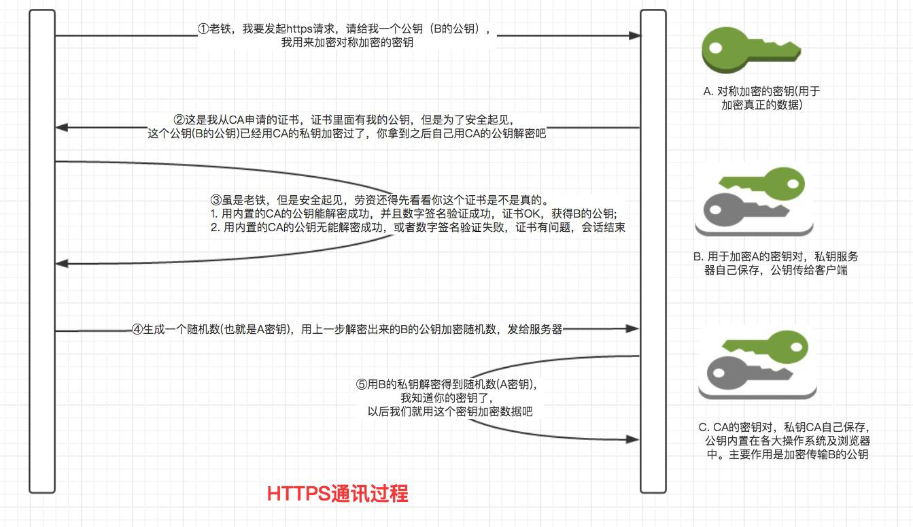
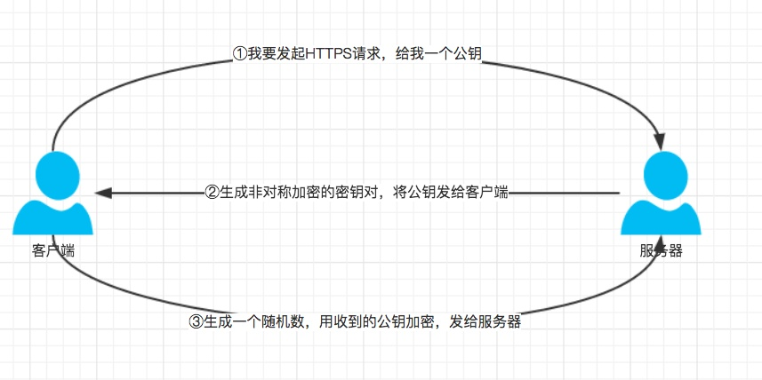
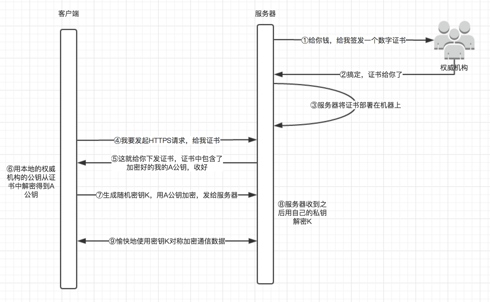

## 前言

推荐一本书 [《图解HTTP》](https://weread.qq.com/web/reader/3da32b505dd9f43da9a1aca)

## 存在即合理

`http`是非常常见的应用层协议，是超文本传输协议的简称，其传输的内容都是明文的。在这个混乱的世界，明文传输信息想想就可怕，网络“小混混”的手段远比我们这些凡人高明得多，他们有一万种方式劫持，篡改我们的数据。对于一个网站或者服务，如果你给你的用户两个选择：

1.  通讯数据明文传输，速度快；
2.  通讯数据加密传输，但是速度可能会稍微慢一点；

我想，只要脑袋没有长歪的用户都宁愿牺牲一点速度去换取数据传输的安全。

这样，`https`的存在就具备了合理性，`https`中的`s`表示`SSL`或者`TLS`，就是在原http的基础上加上一层用于`数据加密、解密、身份认证`的安全层。

## 一层层揭开HTTPS神秘面纱

本文试图通过层层渐进方式来通俗的阐述https的原理，若有错误，欢迎大家指正。

虽然要层层渐进，但是我们不妨先奉上刚画好的还热乎着的https通信完整流程图：

从上图可以看到，右边有一堆钥匙，一看到钥匙我们就能想到这个过程免不了加密。另外，那些钥匙长得还不一样，有些只有一把，有些是一对，嗯，是的，你看得真仔细。

好的，扯远了，现在开始层层渐进。

### 第一层（安全传输数据）

假如我们要实现一个功能：**一个用户A给一个用户B发消息，但是要保证这个消息的内容只能被A和B知道，其他的无论是墨渊上神还是太上老君都没办法破解或者篡改消息的内容。**

如上图，需求就是这么简单，A给B发一条消息，因为比较私密，不想被其他人看到。

由于消息不想被其他人看到，所以我们自然而然就会想到为消息加密，并且只有A和B才有解密的密钥。这里需要考虑几点：

1.  使用什么加密方式？
2.  密钥怎么告知对方？

对于第一个问题，加密算法分为两类：对称加密和非对称加密，这里我们选择对称机密，原因有如下几个：

1.  对称加密速度快，加密时CPU资源消耗少；
2.  非对称加密对待加密的数据的长度有比较严格的要求，不能太长，但是实际中消息可能会很长（比如你给你女朋友发情书），因此非对称加密就满足不了；

对于第二个问题，这是导致整个https通信过程很复杂的根本原因。 如果A或B直接把他们之间用于解密的密钥通过互联网传输给对方，那一旦密钥被第三者劫持，第三者就能正确解密A,B之间的通信数据。

### 第二层（安全传输密钥）

通过第一层的描述，第二层需要解决的问题是：安全地传输A,B之间用于解密数据的密钥。

因为如果传输过程中这把密钥被第三者拿到了，就能解密传通信数据，所以，这把密钥必须得加密，就算第三者劫持到这把加密过的密钥，他也不能解密，得到真正的密钥。

这里有一个问题，那要用什么方式加密这把密钥呢？如果使用对称加密，那这个对称加密的密钥又怎么安全地告诉对方呢？完了，陷入死循环了…. 所以，一定不能用对称加密

那就是用非对称加密咯，那如何应用非对称加密来加密那把密钥呢？

考虑如下方式：

1.  客户端： 我要发起HTTPS请求，麻烦给我一个非对称加密的公钥；
2.  服务器： (生成一对非对称加密的密钥对，然后把公钥发给客户端)，接着，这是公钥；
3.  客户端：（收到公钥，生成一个随机数，作为上图中那一把密钥，用刚才收到的公钥加密这个密钥，然后发给服务器）这是我刚生成的加密过的密钥；
4.  服务器：（收到加密后的密钥，用本地的第一步自己生成的非对称加密的私钥解密，得到真正的密钥）;
5.  现在，客户端和服务器都知道了这把密钥，就能愉快地用这个密钥对称加密数据…

分析一下上面步骤的可行性：

+   上述步骤中最终用于加密数据的密钥是客户端生成并且用公钥加密之后传给服务器的，因为私钥只有服务器才有，所以也就只有服务器才能解开客户端上报的密钥；
+   要保证传输的密钥只能被服务器解密，就得保证用于加密密钥的公钥一定是服务器下发的，绝对不可能被第三方篡改过；

因为还可能存在一种”中间人攻击”的情况，如下图：

这种情况下，客户端和服务器之间通信的数据就完全被坏人破解了。

### 第三层（安全传输公钥）

从上一层可以知道，要保证数据的安全，就必须得保证服务器给客户端下发的公钥是真正的公钥，而不是中间人伪造的公钥。那怎么保证呢？

那就得引入`数字证书`了，数字证书是服务器主动去权威机构申请的，证书中包含了上一个图中的加密过的A公钥和权威机构的信息，所以服务器只需要给客户端下发数字证书即可。现在流程图如下：

那数字证书中的A公钥是如何加密的呢？

答案是`非对称加密`，只不过这里是使用只有权威机构自己才有的私钥加密。

等一下，既然A公钥被权威机构的私钥加密了，那客户端收到证书之后怎么解密证书中的A公钥呢?需要有权威机构的公钥才能解密啊！那这个权威机构的公钥又是怎么安全地传输给客户端的呢？感觉进入了鸡生蛋，蛋生鸡的悖论了~~

别慌，**答案是权威机构的公钥不需要传输，因为权威机构会和主流的浏览器或操作系统合作，将他们的公钥内置在浏览器或操作系统环境中。** 客户端收到证书之后，只需要从证书中找到权威机构的信息，并从本地环境中找到权威机构的公钥，就能正确解密A公钥。

这样就绝对安全了吗？既然权威技能能给服务器签发数字证书，那为什么就不可能给中间人签发数字证书呢?毕竟赚钱的生意权威机构也不会拒绝的呀。

试想一下：

> 服务器给客户端下发数字证书时证书被中间人劫持了，中间人将服务器的证书替换成自己的证书下发给客户端，客户端收到之后能够通过权威机构的公钥解密证书内容（因为中间人的证书也是权威机构私钥加密的），从而获取公钥，但是，这里的公钥并不是服务器原本的A公钥，而是中间人自己证书中的B公钥。从第二层可知，如果不能保证客户端收到的公钥是服务器下发的，那整个通信数据的安全就没法保证。简单总结就是证书被调包~

所以，还得保证客户端收到的证书就是服务器下发的证书，没有被中间人篡改过。

### 四层（安全传输证书）

这一层，我们的任务是：保证客户端收到的证书是服务器下发的证书，没有被中间人篡改过。

所以，这里就有两个需求:

+   证明证书内容没有被第三方篡改过；
+   证明证书是服务器下发的；

其实这些问题，数字证书本身已经提供方案了，数字证书中除了包含加密之后的服务器公钥，权威机构的信息之外，还包含了证书内容的签名(先通过Hash函数计算得到证书数字摘要，然后用权威机构私钥加密数字摘要得到数字签名)，签名计算方法以及证书对应的域名。这样一来，客户端收到证书之后：

+   使用权威机构的公钥解密数字证书，得到证书内容（服务器的公钥）以及证书的数字签名，然后根据证书上描述的计算证书签名的方法计算一下当前证书的签名，与收到的签名作对比，如果一样，表示证书一定是服务器下发的，没有被中间人篡改过。因为中间人虽然有权威机构的公钥，能够解析证书内容并篡改，但是篡改完成之后中间人需要将证书重新加密，但是中间人没有权威机构的私钥，无法加密，强行加密只会导致客户端无法解密，如果中间人强行乱修改证书，就会导致证书内容和证书签名不匹配。所以证书签名就能判断证书是否被篡改
+   再考虑证书被掉包的情况：中间人同样可以向权威机构申请一份证书，然后在服务器给客户端下发证书的时候劫持原证书，将自己的假证书下发给客户端，客户端收到之后依然能够使用权威机构的公钥解密证书，并且证书签名也没问题。但是这个时候客户端还需要检查证书中的域名和当前访问的域名是否一致。如果不一致，会发出警告！

从上面的分析可以看到，数字证书中的信息确实能让客户端辨别证书的真伪。

## REF 

转自：[看完还不懂HTTPS我直播吃翔](https://zhuanlan.zhihu.com/p/25976060)