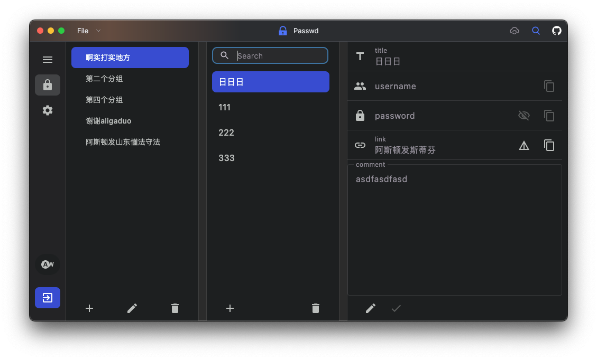
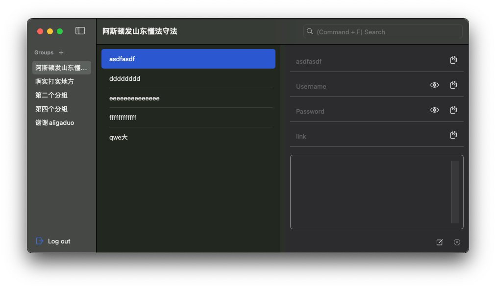

## 背景
有一款效率工具 —— `Utools` 很好用，主要以插件的方式来提供各种功能，并且插件非常丰富。其中有一款插件叫做`“密码管理器”`，可以存储密码，并且依赖 Utools 的`同步功能`实现`多端同步`。

Utools 作为一款效率工具来说是很好用的，但是类似密码管理器多端同步的功能是需要开会员的，99¥/年。除此之外，我几乎没有用到任何需要同步的插件，所以觉得有点不值。

那么，为什么不自己写一个呢。服务器后端数据库好说，之前写过不少项目，简单的后端+数据库我已经写过（后端和数据库不考虑并发和极致的性能优化），框架可以套用。

问题是，桌面端的实现。作为一个爱折腾的码农，Windows、MacOS、Linux 我都用，这个月用 MacOS，下个月说不定就换 Linux 了，所以要做三个桌面端。

至于为什么不考虑移动端，主要是因为现在自己没有这方面的需求，只用 iOS，密码都存在苹果的钥匙串。

理论上来说，我想要的密码管理器功能并不复杂，两个主要的数据结构，`Group` 和 `Passwd`。Group 包含一个 Passwd List 数组，要支持 Group 的增删改查和 Passwd 的增删该差。

除此之外还要有存储用户信息数据结构。最重要和最谨慎的是加密算法的实现。

其实在此之前也查询过类似的开源项目，比如 `Bitwarden`。项目功能很全面也可以支持个人部署，并且是跨平台（桌面端和移动端）。但是为了保证数据传输安全，要开启 `Https`。

但是我的服务器都是今年用阿里，明年用华为，后年用腾讯（不为别的，谁有优惠用谁的，穷），每次新买服务器，一堆东西要配置，如果说再有个域名和证书，每次也要配置（配置过一次，算是踩了不少坑），每次配置一大堆，有点穷折腾的意思了。东西体验过了，配置过了也就没那么有折腾的劲头了，毕竟还有很多新玩意需要花时间去折腾，老玩意折腾来折腾去也就那样。

说了一大堆，其实就是懒得折腾 Https 又想保证个人密码的安全传输（虽然我穷，但是我秉承数据无价），有点为了一碗醋包了顿饺子的感觉...
Anyway，何不自己写一个呢？

## 技术调研

### 桌面端架构
近几年，`KMM` 和 `Compose` 发展势头强劲，`Intellij` 维护的 KMM 跨平台项目发展的比较好。其他的跨平台项目比如 `Flutter` 也考虑过，但考虑到本人专业对口的是 Android 客户端开发，对 Compose 和 Kotlin 的使用已经比较熟练，所以选择了 KMM 来作为桌面端的实现架构。

### 数据存储
密码该怎么存呢？其实最先想到的就是 `MySQL`。但我还是先调研了 Utools 密码管理器的数据存储方式，发现是以`文件`的形式做存储，并且没有做加密处理，可以说是非常不安全。密码管理器没有什么复杂的数据结构和表关系，所以最终还是选择 MySQL 数据库存储

### 加密算法
其实之前基本没有了解过加密算法的问题，经过多方研究（用到的什么加密方式已经忘了……不过应该是安全的），最终选择用户`账号+密码+密钥`的存储方式。`账号+密码`可以登录，但如果密钥不对，密码是不会被正确解析的。密钥最开始由服务端生成，数据库也存储了部分信息，为此还画了一个架构图。但后来写着写着发现服务端为啥要存储密钥，密钥为啥要服务端生成，完全没必要。密钥就由客户端来生成，用户需要当场保存，遗失了就遗失了，存储的密码信息就找不回了。
**毕竟，最危险的就是最安全的……**

## 其他需求

几个重点问题都已经调研清楚，但在写代码之前，需要再明确一下个人需求。

1. `用户登录能力`

2. `分组能力`，密码要分组，即开篇提到的 Group 和 Passwd，所以 UI 应该分为三列：Groups、Passwds、PasswdDetail。Group 和 Passwd 可以自定义顺序，并且 Passwd 可以剪切到其他 Group。

3. `密码导出、导入`。

4. `同步功能`。多端登录的情况下，密码要能够实时同步。同步策略应该是怎样的？增删改查的优先级？

截止 2024 年 4 月，功能 1 已经基本实现，但是尚未实现修改密码的能力，优先级不高。
功能 2 实现了一部分，自定义顺序和分组的能力暂未实现，因为还没有调研到最好的顺序储存方式。
功能 3 实现了密码的导出，导入优先级不高。
功能 4 没有实现，这个工作量可能比较大，目前调研到基础的方法就是 WebSocket，优先级也不高。

## 踩坑

跨端开发，边学边做的过程中还是遇到了一些问题的。比如对于各个平台`差异性的适配`。个人认为 KMM 在桌面端的适配已经做的比移动端简便很多了，相比移动端的差异性已经少了很多，也可能是我认知的问题，毕竟项目简单，没有涉及到特别复杂的问题。比如 OpenGL 在各个平台的适配。

非原生在体验上还有几个比较明显的问题：
1. `启动速度慢`。在 macOS 还好，不管是 intel 还是 arm 芯片，基本都能做到秒启动。启动最快的当属我的 M1 pro 的 MacBook pro（arm），其次是我的 Hackintosh（intel），Windows 启动最慢，都有点煎熬了）
2. `包体积大`。在三个平台，包体积大概都占用 7、8 十兆（混淆过的，不混淆还得大个几十兆
3. `内存占用大`。 Linux 是比较低的，另外两个是相对高的。但就算 linux 相对低也会占用 2、3 百兆的内存空间，随便点几个 Item 甚至会飙升到 5、600

虽说现在随随便便一个 app 都数十兆几百兆，但是我这个密码管理器又没有什么复杂的功能，也没有像 QQ 那样直接打包了游戏引擎，奔 100M 包体积是不是有点离谱了？（当对比实现了相同功能的原生 macOS app 后会发现 KMM 包体积是多么离谱）。

网上查了一下，内存占用问题算是各种跨平台技术的共性问题。包括 `Flutter`、`Electron`，都会动辄`几百兆`的内存空间占用，甚至 `Bitwarden` 的桌面端（也是跨平台），记得看了下应该也有 `2、3 百兆`的内存占用（当然，人家的 app 功能多）。不过据说跨平台内存占用的问题完全可以优化，比如 `VS Code`，人也是用的跨平台 `Electron` 技术，但是内存占用就优化的很不错。后续可以考虑下如何优化内存，但看起来似乎不是一个简单的任务。在不考虑内存深度优化的基础上，我寻思我一个简单的密码管理器，主要页面就一个，分成了两个 List 和一个 ViewGroup，占用几百兆也太离谱了吧？？不如考虑下原生开发？比如 `macOS-SwiftUI`？

## macOS 原生开发

说干就干，最近用的比较多的是 macOS 系统，个人也非常喜欢 macOS 的交互和 UI。新建了一个 demo 查看其内存占用，果不其然给了我很大的惊喜，`20M！` 这才像话嘛。

最终实现了 macOS 原生开发的 Passwd 包体积 `2M` 多一点，内存占用大概 `3、5 十兆`，相比 KMM 舒服多了～

关键是人 UI 也好看，毕竟原生嘛，风格都用默认的就是最适配 macOS 系统的，也是最顺眼的。开发起来感觉也比较简便，还是那句话，毕竟原生嘛，亲儿子。

有时间再记录下 详细记录下 KMM 跨平台和 macOS 原生开发的细节。

## 代码仓库

- [后端](https://github.com/Leslie-DD/PasswdBackend)
- [KMM 客户端](https://github.com/Leslie-DD/PasswdDesktop)
- [原生 macOS 客户端](https://github.com/Leslie-DD/PasswdAppForMacOS)