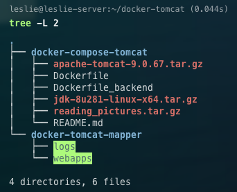

::: info 背景
[上篇：Idea 部署项目到远程 Tomcat 踩坑](/tutorial/server/IdeaRemoteDeploy.md) 搞定后发现服务器主机tomcat占用内存有点大，本着折腾的精神，想看看能否实现 `Idea 远程部署项目到服务器的 Docker Tomcat`，所以就有了本篇和[下篇：Idea 部署项目到远程 Docker Tomcat](/tutorial/server/IdeaRemoteDockerDeploy.md) 

本篇内容主要实现服务器下 Tomcat 的 Docker 镜像创建。
:::


## 1. 新建文件夹，目录树如下
在~目录下新建 `docker-tomcat` 文件及其子文件

 

- `docker-compose-tomcat` 用来存储Dockerfile相关的文件
- `apache-tomcat-9.0.67.tar.gz` tomcat的文件，可以是官网下载的，也可以是自己自定义过的
- `jdk-8u281-linux-x64.tar.gz` jdk文件，配置tomcat怎么能没有jdk呢
- `README.md` 写点注释啥的
- `Dokcerfile` docker build 时会自动寻找这个Dockerfile文件

- `docker-tomcat-mapper` docker容器中tomcat目录下部分文件在本机的映射，这里只映射了tomcat下两个文件夹：webapps和logs
- `webapps` 用来部署项目的位置，后面启动镜像的时候会配置
- `logs` 生成的log都在这个文件夹下，后面启动镜像的时候会配置


## 2. 编写Dockerfile文件

```bash
FROM ubuntu:latest
MAINTAINER leslie<XXXXXX@xxx.com>

RUN mkdir /home/tomcat
# 把宿主机当前上下文的README.md拷贝到容器/usr/tomcat/路径下
COPY README.md /home/tomcat/README.md

# 把宿主机当前上下文的（也就是当前目录）java与tomcat安装包添加到容器中
ADD apache-tomcat-9.0.67.tar.gz /home/tomcat/
ADD jdk-8u281-linux-x64.tar.gz /home/tomcat/
ADD reading_pictures.tar.gz /root/

# 安装vim编辑器
RUN apt-get update
RUN apt-get install -y vim

# 设置工作访问时候的MORKDIR路径，登录DE 落脚点
ENV MYPATH /home/tomcat/apache-tomcat-9.0.67
WORKDIR $MYPATH

# 配置java与tomcat环境变量

# 配置java环境
ENV JAVA_HOME /home/tomcat/jdk1.8.0_281
ENV CLASSPATH $JAVA_HOME/lib/dt.jar:$JAVA_HOME/lib/tools.jar # 通过冒号隔开

# 配置tomcat环境
ENV CATALINA_HOME /home/tomcat/apache-tomcat-9.0.67
ENV CATALINA_BASE /home/tomcat/apache-tomcat-9.0.67

# 把上面配置的环境放入到PATH环境变量中
ENV PATH $PATH:$JAVA_HOME/bin:$CATALINA_HOME/lib:$CATALINA_HOME/bin

# 容器运行时监听的端口（暴露端口）
EXPOSE 8080
EXPOSE 1099


# 启动时运行tomcat
# ENTRYPOINT ["/usr/local/apache-tomcat-9.0.67/bin/startup.sh"]
# CMD ["/usr/local/apache-tomcat-9.0.67/bin/catalina.sh","run"]
CMD /home/tomcat/apache-tomcat-9.0.67/bin/startup.sh && tail -F /home/tomcat/apache-tomcat-9.0.67/bin/logs/catalina.out
# && 表示拼接下一条命令，可以无线的拼接。
```


## 3. 构建镜像

```bash
sudo docker build -t docker-tomcat9 .
```

::: warning
如果出现timeout问题，可以尝试修改docker的镜像地址为阿里云的。
修改或新建`/ect/docker/daemon.json`文件,在里面加入阿里云镜像地址
```bash
{
 "registry-mirrors":["https://6kx4zyno.mirror.aliyuncs.com"]
}
```
重启docker
```bash
sudo service docker restart
```
:::


## 4. 启动镜像

```bash
sudo docker run \
-p 8081:8080 \
-p 1099:1099 \
--name tomcat9 \
-v ~/docker-tomcat/docker-tomcat-mapper/webapps:/home/tomcat/apache-tomcat-9.0.67/webapps \
-v ~/docker-tomcat/docker-tomcat-mapper/logs/:/home/tomcat/apache-tomcat-9.0.67/logs \
--privileged=true \
-d tomcat9
```

## 参考

https://www.cnblogs.com/liuyuelinfighting/p/16415468.html
https://blog.csdn.net/qq_46153157/article/details/126122042