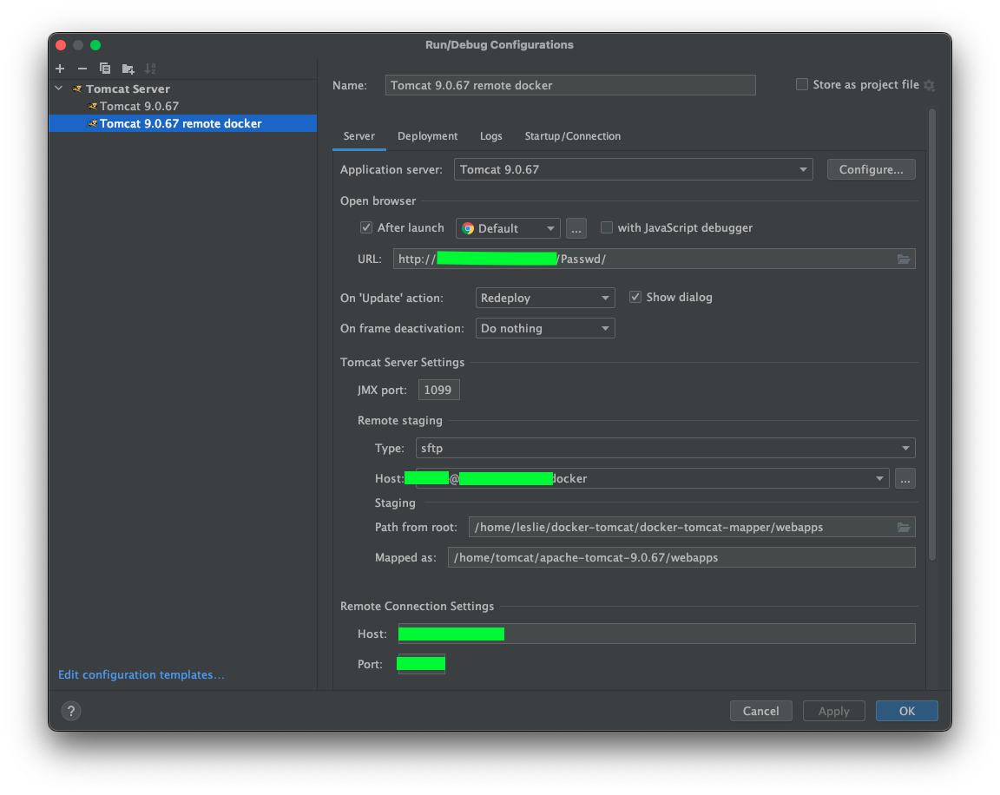
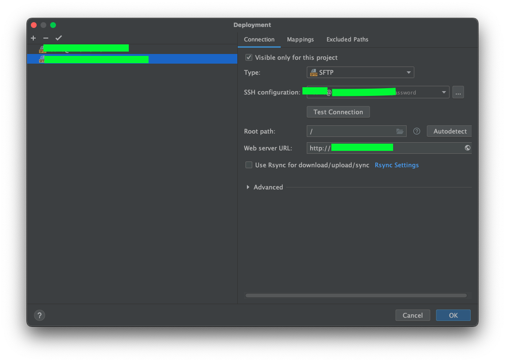
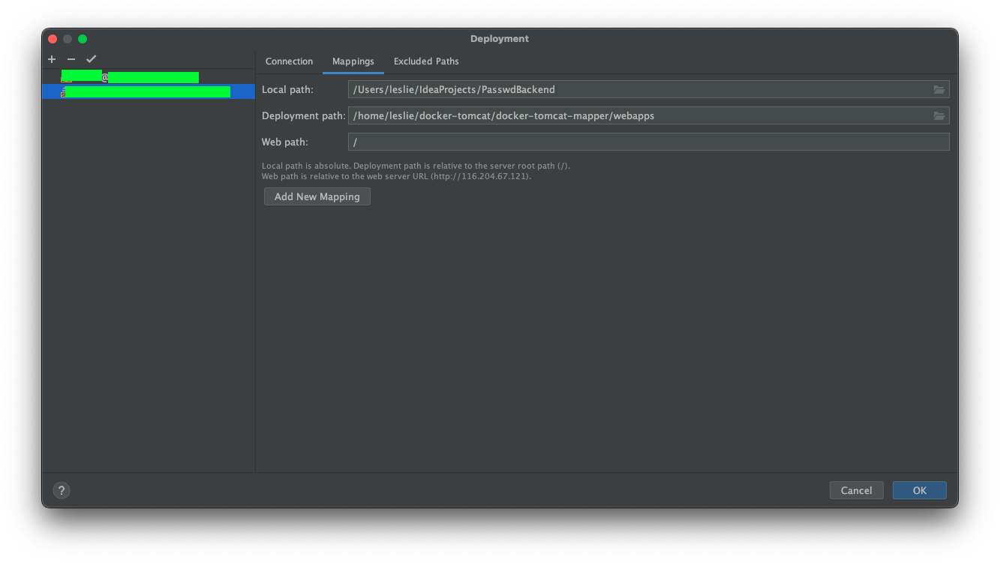

::: info 背景
[上篇：自定义 Dokcer Tomcat](/tutorial/server/BuildDocker.md) 完成后，本篇就来记录下遇到的坑……主要是文件路径的问题
:::

## 配置

首先新建一个 Tomcat remote configuration，如图写好相关信息。

::: tip Mapper
注意这里的 `Path from root` 和 `Mapped as`，因为要连接的是远程服务器上 Docker 的 Tomcat，所以：
- `Path from root` 要填 `服务器本机映射的 webapps 路径`
- `Mapped as` 填的是服务器 tomcat `docker 容器内的 webapps 路径`
:::

 

再来配置服务器连接

 

这里 Deployment Path 要填 `服务器本机映射的 webapps 路径`

 

 ## 总结
 最终，这一套流程算是搞定了。
 
 总结下，首先服务器部署了 Tomcat，并实现了 Idea 远程部署项目，见[Idea 部署项目到远程 Tomcat](/tutorial/server/IdeaRemoteDeploy.md)。
 
 但由于不如 Docker 好管理，且觉得占内存有点多，所以想着用 Docker 自建一个 Tomcat Docker 镜像，就有了[自定义 Dokcer Tomcat](/tutorial/server/BuildDocker.md)这篇。

 Docker Tomcat 部署好后，发现沿用[Idea 部署项目到远程 Tomcat](/tutorial/server/IdeaRemoteDeploy.md)这一套的 Idea 链接配置已经不再适用，又有了本篇记录。

